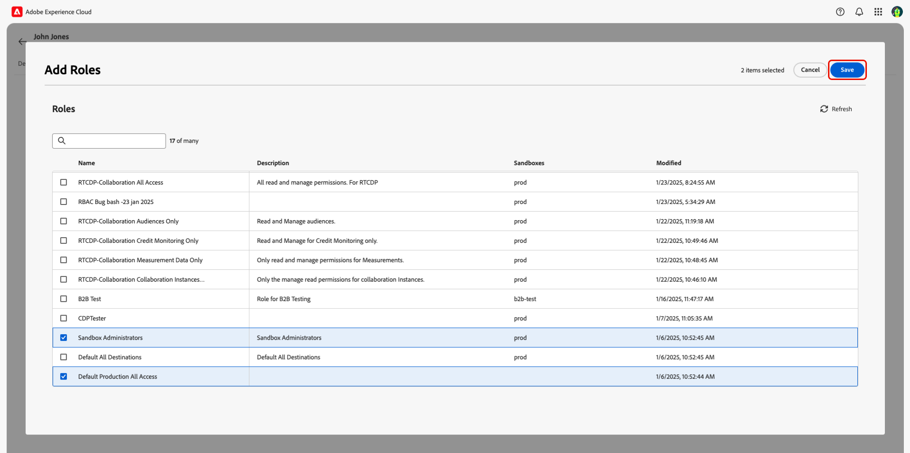

# Administrar el acceso de los usuarios mediante permisos {#manage-user-access}

{{limited-availability-release-note}}

Administre permisos y acceso de usuarios a componentes individuales dentro de Adobe Real-Time CDP Collaboration a través de la interfaz de Experience Cloud [Permissions](https://experienceleague.adobe.com/es/docs/experience-platform/access-control/abac/permissions-ui/browse){target="_blank"}. Los permisos permiten a los administradores de sistemas y productos definir [roles](./manage-roles.md) para administrar el acceso de los usuarios a características y recursos específicos.

## Configuración del acceso a los permisos {#permissions-access}

Para acceder a los permisos, debe tener acceso de administrador de producto y de usuario al producto de Adobe Experience Platform. Se requiere un administrador del sistema para configurar los privilegios de administrador de productos, mientras que un administrador del sistema o de productos puede configurar los privilegios de usuario. Para obtener más información sobre las funciones administrativas, lea la guía [jerarquía de control de acceso](./overview.md#hierarchy).

>[!TIP]
>
>A lo largo de esta guía, un **administrador** hará referencia a **administradores de sistemas y productos**.

### Administradores del sistema: configurar el acceso de administrador de productos {#admin-access}

Conceda a un administrador de productos de usuario acceso para proporcionarle funciones administrativas dentro del producto de Experience Platform mediante los siguientes pasos:

>[!IMPORTANT]
>
>Como administrador del sistema, tiene acceso predeterminado a productos específicos de Experience Cloud, como Adobe Admin Console. Sin embargo, para utilizar Permisos, es necesario que se proporcione a sí mismo un acceso de administrador y usuario del producto de Experience Platform. Siga la guía paso a paso que se muestra a continuación para concederse acceso como administrador del sistema.

Inicie sesión en [Adobe Experience Cloud](https://experience.adobe.com/){target="_blank"} con sus credenciales. La vista Inicio se muestra con una lista de los productos disponibles en la sección **[!UICONTROL Acceso rápido]**. Seleccione **[!UICONTROL Admin Console]**.

{zoomable="yes"}

Se muestra el panel de información general de [Adobe Admin Console](https://adminconsole.adobe.com/). Seleccione **[!UICONTROL Adobe Experience Platform]** de la lista **[!UICONTROL Productos]** en **[!UICONTROL Productos y servicios]**.

{zoomable="yes"}

Se muestra el panel de Adobe Experience Platform. Seleccione la ficha **[!UICONTROL Administradores]** y luego seleccione **[!UICONTROL Agregar administrador]**.

{zoomable="yes"}

Aparecerá el cuadro de diálogo **[!UICONTROL Agregar administradores de productos]**. Introduzca el correo electrónico o el nombre de usuario en el campo de texto **[!UICONTROL Correo electrónico o nombre de usuario]** y, a continuación, seleccione la cuenta correcta en el menú desplegable. Seleccione **[!UICONTROL Guardar]** para finalizar la adición del usuario como administrador de productos.

{zoomable="yes"}

El usuario ahora tiene privilegios de administrador de productos y puede realizar funciones administrativas, como agregar usuarios u otros administradores, al producto en Admin Console. A continuación, necesitará el acceso de usuario al producto de Experience Platform para acceder y realizar funciones dentro de Permisos.

### Administradores: configurar el acceso de los usuarios a Experience Platform {#user-access}

Ahora que ha concedido al administrador de productos acceso, debe proporcionarle acceso de usuario al producto de Experience Platform. Como parte de las configuraciones de acceso, asignará al usuario [perfiles de producto](https://helpx.adobe.com/es/enterprise/using/manage-product-profiles.html) específicos.

>[!TIP]
>
>Si está siguiendo los pasos de la sección anterior, ya estará dentro del producto de Adobe Experience Platform y puede omitir el primer paso.

Vaya a [Admin Console](https://adminconsole.adobe.com/){target="_blank"} y seleccione **[!UICONTROL Adobe Experience Platform]** de la lista **[!UICONTROL Productos]** en **[!UICONTROL Productos y servicios]**.

{zoomable="yes"}

Seleccione la ficha **[!UICONTROL Usuarios]** y luego seleccione **[!UICONTROL Agregar usuarios]**.

{zoomable="yes"}

Aparecerá el cuadro de diálogo **[!UICONTROL Agregar usuarios a este producto]**. Escriba el nombre o el correo electrónico del usuario en el campo de texto **[!UICONTROL Nombre, grupo de usuarios o dirección de correo electrónico]** y, a continuación, seleccione la cuenta correcta en el menú desplegable. A continuación, seleccione la opción de adición **[!UICONTROL Productos]**.

{zoomable="yes"}

Aparecerá el cuadro de diálogo **[!UICONTROL Seleccionar perfiles de producto]**. Seleccione **[!UICONTROL AEP-Default-All-Users]** y **[!UICONTROL Acceso predeterminado a todas las aplicaciones de producción]** y, a continuación, seleccione **[!UICONTROL Aplicar]**.

{zoomable="yes"}

Confirme que la información es correcta y, a continuación, seleccione **[!UICONTROL Guardar]**.

{zoomable="yes"}

El usuario ahora debe tener acceso de administrador de productos y productos a Experience Platform, lo que le permitirá acceder a los permisos. A continuación, debe asignar al usuario dos funciones fundamentales para que tenga acceso a la interfaz de usuario de Experience Platform.

### Administradores: configurar el acceso a la IU de Experience Platform {#product-access}

En Real-Time CDP Collaboration, los administradores y los usuarios finales trabajarán con datos de Experience Platform, como audiencias y registros de auditoría. Estos datos se mantienen en instancias de Experience Platform denominadas zonas protegidas. Para garantizar que los usuarios puedan interactuar con estos datos, debe asignar [funciones predeterminadas](https://experienceleague.adobe.com/es/docs/experience-platform/access-control/home#default-roles){target="_blank"} al usuario.

Para empezar, ve a [Adobe Experience Cloud](https://experience.adobe.com/). Ahora debería ver **[!UICONTROL Experience Platform]** y **[!UICONTROL Permisos]** dentro de **[!UICONTROL Acceso rápido]**.

{zoomable="yes"}

>[!NOTE]
>
> Los productos pueden tardar varios minutos en obtener acceso a y recibirá un correo electrónico que le avisará de que ha recibido acceso. Si no ve Experience Platform o Permisos en Adobe Experience Cloud después de recibir el correo electrónico, cierre la sesión y vuelva a iniciarla en la cuenta.

En este momento, ahora puede obtener acceso a **[!UICONTROL Permisos]**. Si intentas acceder a **[!UICONTROL Experience Platform]**, recibirás una advertencia avisando que no hay zonas protegidas habilitadas, como se muestra a continuación. Para resolver esto, debe asignar las funciones predeterminadas al usuario. Para empezar, seleccione **[!UICONTROL Permisos]**.

{zoomable="yes"}

Se mostrará el panel **[!UICONTROL Permisos]**. Seleccione **Usuarios** en el panel izquierdo y, a continuación, seleccione el nombre del usuario.

{zoomable="yes"}

Seleccione la ficha **[!UICONTROL Roles]** y luego seleccione **[!UICONTROL Agregar roles]**.

{zoomable="yes"}

Aparecerá el cuadro de diálogo **[!UICONTROL Agregar roles]**. Seleccione **[!UICONTROL Acceso predeterminado a todos los equipos de producción]** y **[!UICONTROL Administradores de espacio aislado]** y, a continuación, seleccione **[!UICONTROL Guardar]**.

{zoomable="yes"}

Ahora tiene acceso a Experience Platform y a Permisos. En el último paso, concederá acceso a Real-Time CDP Collaboration.

### Administradores: configurar el acceso a Real-Time CDP Collaboration {#RTCDP-collaboration-access}

>[!CONTEXTUALHELP]
>id="rtcdp_collaboration_organization_permissions"
>title="guía de administración de acceso de usuarios"
>abstract=""

Para conceder a los usuarios acceso a Collaboration, utilizará un concepto de control de acceso denominado funciones. Las funciones definen el nivel de acceso que un administrador o usuario tiene a [recursos](https://experienceleague.adobe.com/es/docs/experience-platform/access-control/home#permissions) en su organización.

Al configurar el acceso individual a Collaboration, debe asignar las funciones de los usuarios que contengan permisos del recurso de colaboraciones. Puede usar la guía [administrar roles](./manage-roles.md) para obtener información sobre:

- las [dos funciones estándar](./manage-roles.md#standard-roles) y los niveles de acceso que conceden a Collaboration
- creando [funciones personalizadas](./manage-roles.md#specific-access-roles) con el recurso de Collaboration
- la lista de permisos incluidos en el recurso de colaboraciones

>[!NOTE]
>
>Además, se debe asignar a un usuario a una función que contenga el permiso **[!UICONTROL Prod]** en los recursos **[!UICONTROL Sandboxes]**. Ambas funciones estándar contienen este permiso. Si decide asignar a un usuario una función personalizada en lugar de una función estándar, debe asegurarse de que una de las funciones para las que está asignado contenga este permiso.

Una vez que haya elegido o creado una función que incluya el nivel de acceso que necesita el usuario, debe asignarle dicha función.

#### Asignar un rol

Puede asignar varias funciones a un único usuario o asignar varios usuarios a una única función. El primer caso se trató anteriormente al [asignar los roles predeterminados](#product-access) para que un usuario tenga acceso a Experience Platform. En los pasos siguientes, asignará usuarios directamente a la función que ha seleccionado.

En **[!UICONTROL Permisos]**, seleccione **[!UICONTROL Roles]** en el panel izquierdo y, a continuación, seleccione su rol en la lista.

{zoomable="yes"}

Se muestra la página de detalles de la función. Seleccione la ficha **[!UICONTROL Usuarios]** y luego seleccione **[!UICONTROL Agregar usuarios]**.

{zoomable="yes"}

Aparecerá el cuadro de diálogo **[!UICONTROL Agregar usuarios]**. Seleccione a los usuarios de la lista y luego seleccione **[!UICONTROL Guardar]**.

{zoomable="yes"}

El usuario debería ver **[!UICONTROL RTCDP Collaboration]** enumerado como producto en **[!UICONTROL Acceso rápido]** en Experience Cloud.

## Pasos siguientes

Ahora que los usuarios tienen acceso a Real-Time CDP Collaboration, pueden empezar a utilizar el producto. Para obtener más información sobre el producto en su conjunto, lea la [guía de información general](../home.md).
