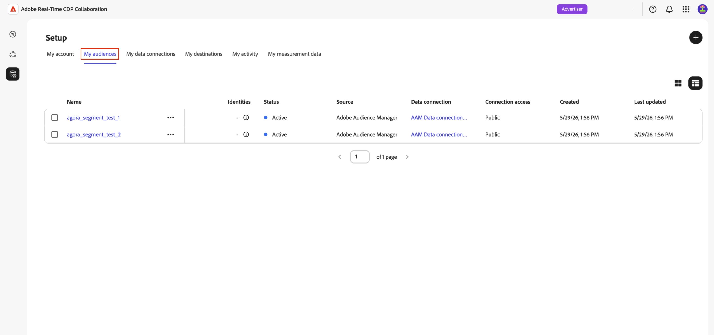

# Configuración de Adobe Audience Manager para el abastecimiento de audiencias

Aprenda a conectar la instancia de Adobe Audience Manager (AAM) a Adobe Real-Time CDP Collaboration para poder obtener segmentos de origen aptos en la plataforma. Después de crear la conexión, Collaboration recupera la pertenencia a audiencias de Adobe Audience Manager en una programación recurrente y las pone a disposición para el análisis de superposición y la activación dentro de sus proyectos de colaboración.

>[!NOTE]
>
> Las audiencias procedentes de Audience Manager siguen las mismas reglas de control y gestión de datos que las audiencias procedentes de Adobe Experience Platform. Solo son aptos los segmentos creados a partir de fuentes de datos de origen. No se admiten segmentos que incluyan datos de terceros o fuentes de Audience Marketplace.

## Requisitos previos {#prerequisites}

Complete todos los elementos de esta sección antes de iniciar el flujo de trabajo de configuración. Los requisitos previos incompletos son el motivo más común por el que la configuración falla o las audiencias no aparecen después del abastecimiento. Antes de seguir esta guía, debes haber completado la [incorporación y configuración de la cuenta](./onboard-account.md).

### Acceso y permisos de Adobe Audience Manager {#aam-access-and-permissions}

Antes de continuar, confirme que dispone de lo siguiente:

* Un contrato activo de Adobe Audience Manager y una instancia de Audience Manager aprovisionada.
* Acceso a la interfaz de usuario de Audience Manager con permiso para ver los segmentos de los que desea obtener un origen.
* La instancia de Audience Manager y la cuenta de Collaboration se han aprovisionado en la misma organización de IMS de Adobe. No se admite el abastecimiento entre organizaciones.

### Requisitos de idoneidad de segmentos {#aam-segments-requirements}

Al configurar la conexión, Collaboration filtra automáticamente la lista de segmentos en función de las siguientes reglas.

**Solo datos de origen**

Solo están disponibles para su abastecimiento los segmentos basados en sus propios datos de origen. Se excluyen los segmentos que incluyen características de proveedores de datos de terceros o AAM Audience Marketplace.

**Filtro de actualización**

Solo los segmentos que se crearon o actualizaron **en los últimos 13 meses** están disponibles para su obtención. Los segmentos más antiguos se excluyen durante la configuración de la conexión y en cada actualización posterior.

### Requisitos de consentimiento {#consent-requirements}

Todos los segmentos de AAM procedentes de Collaboration deben filtrarse después del consentimiento. Si hay un marcador de exclusión para un perfil en el momento de la exportación, ese perfil se excluye antes de que llegue a Collaboration.

>[!IMPORTANT]
>
>Usted es responsable de garantizar que el consentimiento se configure y aplique correctamente en la instancia de Audience Manager antes de conectarse a Collaboration. Adobe no vuelve a aplicar las reglas de consentimiento una vez que los datos abandonan Audience Manager.

## Configuración de la conexión de Audience Manager {#configure-aam-connection}

El flujo de trabajo de configuración es un asistente de varios pasos dentro del área de trabajo **[!UICONTROL Setup]**. Complete cada paso de forma secuencial. Puede volver a cualquier paso con el icono de lápiz de la pantalla de revisión final antes de crear la conexión.

### Añadir una conexión de datos {#add-data-connection}

En la ficha **[!UICONTROL Mis audiencias]** del área de trabajo **[!UICONTROL Configuración]**, seleccione el icono de agregar () y luego seleccione **[!UICONTROL Audiencia]**.

Si esta es su primera audiencia, también puede seleccionar la opción **[!UICONTROL Agregar audiencia]**.

Aparecerá el flujo de trabajo Añadir audiencia. Seleccione **[!UICONTROL Agregar una nueva conexión de datos]** y, a continuación, seleccione **[!UICONTROL Siguiente]**.

{zoomable="yes"}

### Seleccione Adobe Audience Manager como conexión de datos {#select-aam}

La pantalla de selección de fuentes de datos enumera todos los tipos de conexión disponibles. Seleccione **[!UICONTROL Adobe Audience Manager]** como conexión de datos y luego seleccione **[!UICONTROL Siguiente]**.

### Confirmar el consentimiento y el uso de los datos {#confirm-consent-data-use}

Antes de continuar, confirme que ha aplicado cualquier exclusión requerida por la ley a los datos de audiencia que envía a Collaboration. Si no está seguro de si sus datos cumplen con este requisito, revise la guía de [directiva de gobernanza y acciones de aplicación](./onboard-audiences.md#governance-policy-and-enforcement-actions) antes de continuar. Seleccione la casilla de verificación de confirmación y, a continuación, seleccione **[!UICONTROL Aceptar]** para continuar.

### Proporcionar detalles de conexión {#provide-connection-details}

A continuación, escriba un nombre y una descripción opcional para esta conexión de datos. Una vez creada la conexión, el nombre que proporcione aparecerá en la ficha **[!UICONTROL Mis conexiones de datos]** y le ayudará a identificar este origen en el futuro.

* **[!UICONTROL Nombre de conexión de datos]** (obligatorio)
* **[!UICONTROL Descripción de la conexión de datos]** (opcional)

Cuando termine, seleccione **[!UICONTROL Siguiente]**.

### Revisar asignación de identidad {#review-identity-mapping}

La pantalla **[!UICONTROL Mapping]** es de solo lectura. Collaboration asigna automáticamente la salida de identidad admitida de los segmentos de AAM a los campos de identidad de Collaboration. Consulte la siguiente tabla para obtener más información.

| Salida de identidad de AAM | Campo de identidad de Collaboration | Notas |
| ------------------- | ---------------------------- | ----- |
| `Demdex ID` | `DEMDEX_ID` | Salida de identidad admitida para esta integración. Collaboration no traduce el ID de Demdex a ECID durante el abastecimiento. |
| `GAID` | `GAID` | Salida de identidad admitida para esta integración. |
| `IDFA` | `IDFA` | Salida de identidad admitida para esta integración. |

{style="table-layout:auto"}

Puede revisar la asignación, pero no puede modificarla en esta fase. Haga clic en **[!UICONTROL Siguiente]** para continuar.

### Programar actualización de datos {#schedule-data-refresh}

En la vista **[!UICONTROL Programar]**, establezca la frecuencia de actualización con la que Collaboration recupera los datos actualizados de pertenencia a audiencias de sus segmentos de AAM y defina el intervalo de fechas activo para el abastecimiento.

Utilice el menú desplegable **[!UICONTROL Frecuencia]** para seleccionar un intervalo de actualización entre uno y seis días. A continuación, utilice el calendario para establecer las fechas de inicio y finalización del abastecimiento de audiencias. Cuando se llega a la fecha de finalización, el abastecimiento se detiene y las audiencias obtenidas anteriormente caducan.

>[!IMPORTANT]
>
>Los segmentos de Audience Manager suelen actualizarse cada 24 a 48 horas en función de la actualización de características y las reglas de frecuencia. Configurar un intervalo de actualización de Collaboration inferior a este puede consumir créditos de Collaboration sin resultados actualizados. Para supervisar tu uso de crédito, consulta [Rastrear tu actividad de consumo de crédito](./my-activity.md).

Una vez finalizado, seleccione **[!UICONTROL Siguiente]**.

### Seleccionar públicos {#select-audiences}

Puede ver una lista de los segmentos aptos que utilizan características de fuentes de datos de origen y que se han creado o actualizado en los últimos 13 meses.

Seleccione los segmentos de origen que desea introducir en Collaboration. Puede buscar por nombre o desplazarse para buscar segmentos específicos. Seleccione **[!UICONTROL Siguiente]** cuando haya terminado.

>[!TIP]
>
>Si un segmento que espera ver no aparece en la lista, compruebe que se ha actualizado en los últimos 13 meses y que solo utiliza características de fuentes de datos de origen. Se excluyen los segmentos con características de terceros o Audience Marketplace.

### Revisión y finalización de la conexión {#review-and-complete}

Revise el resumen completo de la configuración antes de crear la conexión. La pantalla de resumen muestra las siguientes secciones:

* **[!UICONTROL Detalles]**: nombre y descripción opcional de esta conexión de datos.
* **[!UICONTROL Selección de audiencia]**: Los segmentos de AAM que seleccionó.
* **[!UICONTROL Asignación]**: la asignación del campo de identidad de los campos de origen de AAM a los campos de identidad de Collaboration.
* **[!UICONTROL Programación]**: La frecuencia de actualización y el intervalo de fechas activo.

Seleccione el icono de lápiz () junto a cualquier sección si necesita realizar cambios. Seleccione **[!UICONTROL Completar]** para confirmar todas las secciones.

Aparece un cuadro de diálogo de confirmación que indica que se creó la conexión de datos y que el abastecimiento de audiencias está en curso.

## Revisar audiencias de origen {#review-sourced-audiences}

Una vez completado el asistente, Collaboration empieza a recuperar de forma asíncrona los datos de pertenencia a audiencias de los segmentos de AAM seleccionados. Vaya a **[!UICONTROL Configuración] > [!UICONTROL Mis audiencias]** para supervisar el progreso.

### Monitorización del progreso de abastecimiento de audiencia {#monitor-progress}

Mientras Collaboration recupera los datos del segmento AAM, un banner en la parte superior del área de trabajo **[!UICONTROL Mis audiencias]** indica que el abastecimiento está en curso. Las audiencias individuales aparecen en la lista a medida que el abastecimiento finaliza para cada segmento.

### Ver detalles de la audiencia de origen {#view-sourced-audience-details}

Una vez finalizado el abastecimiento, los segmentos de AAM aparecerán en la pestaña **[!UICONTROL Mis audiencias]**. La columna **[!UICONTROL Source]** los identifica como **[!UICONTROL Adobe Audience Manager]**.

Seleccione una fila o la opción **[!UICONTROL Ver audiencia]** para abrir la vista de detalles de una audiencia específica.

La vista de detalles muestra:

* **[!UICONTROL Identidades]**: El recuento total de identidades y cualquier información de desglose disponible.
* **[!UICONTROL Categorías]**: Cualquier etiqueta que haya aplicado para organizar o filtrar la audiencia.
* **[!UICONTROL Acceso a la conexión]**: Indica si la audiencia es privada, pública o compartida con colaboradores específicos.
* **[!UICONTROL Visibilidad de metadatos]**: Qué información de audiencia es visible para los colaboradores.

![Vista de detalles de audiencia individual que muestra el estado: Activo, el sistema de origen y el nombre de la conexión de datos en la parte superior, con cuatro paneles a continuación: Identidades que muestran el recuento y el desglose de identidades, Categorías que muestran etiquetas aplicadas, Acceso a la conexión que muestra el tipo de audiencia y la visibilidad, y Visibilidad de metadatos que muestra la configuración del recuento de identidades, el porcentaje de superposición y el índice de audiencia.](../../assets/setup/aam-audience-sourcing/audience-manager-sourced-audience-details.png)

Utilice esta vista para confirmar los ajustes de configuración de audiencia y visibilidad antes de utilizar la audiencia en proyectos de colaboración. Para actualizar categorías, acceso a conexiones o visibilidad de metadatos, consulte [Ver y administrar audiencias individuales](./onboard-audiences.md#view-individual-audiences).

## Limitaciones conocidas

Tenga en cuenta las siguientes restricciones al configurar y utilizar el conector de origen de Audience Manager:

* **Solo datos de origen:** Los segmentos que incluyen características de proveedores de datos de terceros o Adobe Audience Marketplace no se pueden obtener. Solo son aptos los segmentos creados completamente a partir de sus propias fuentes de datos de origen.
* **Ventana de actualización de segmentos de 13 meses:** Solo los segmentos creados o actualizados en los últimos 13 meses están disponibles para su selección durante la configuración y en cada actualización programada.
* **Sin actualización a petición:** Los datos de audiencia se actualizan según la programación que configure. No se admite la actualización manual e inmediata.
* **Una conexión AAM activa por organización:** Solo se admite una conexión de datos AAM activa por organización IMS.
* **Restricciones de clave de coincidencia:** Una vez habilitada una clave de coincidencia para una conexión de datos, no se puede quitar. Para cambiar las claves de coincidencia activas, elimine la conexión y cree una nueva.

## Resolución de problemas {#troubleshooting}

Lea esta sección para resolver problemas comunes después de establecer la conexión inicial.

**Las audiencias no aparecen o el abastecimiento está tardando más de lo esperado**

* El tiempo de abastecimiento se amplía con el número de segmentos seleccionados y el tamaño de cada población de segmentos.
* Si las audiencias no aparecen en un plazo de 24 horas, confirme que los segmentos seleccionados siguen activos en Audience Manager y que tienen recuentos de población distintos de cero.
* Compruebe la pestaña **[!UICONTROL Mis conexiones de datos]** para ver si hay indicadores de error en la conexión.
* Si el problema persiste, póngase en contacto con el servicio de atención al cliente de Adobe con su nombre de conexión de datos y los nombres de los segmentos que no aparecen.

**Un segmento que esperaba seleccionar no estaba disponible durante la instalación**

Confirme que el segmento:

* Se creó o actualizó por última vez en los últimos 13 meses. No se muestran los segmentos más antiguos.
* Utiliza solo rasgos de origen. Se excluyen los segmentos con características de terceros o Audience Marketplace.
* Pertenece a la organización de IMS configurada para la conexión.

**La conexión de datos muestra un estado de error después de haberse realizado correctamente inicialmente**

* Confirme que la relación de la organización IMS entre la instancia de AAM y la cuenta de Collaboration no ha cambiado.
* Confirme que los segmentos seleccionados siguen existiendo en AAM y que no se han eliminado.
* Si el problema continúa, [elimine la conexión](./manage-data-connection.md#delete-data-connection) y cree una nueva, o comuníquese con la atención al cliente de Adobe.

## Próximos pasos {#next-steps}

Ahora ha configurado Audience Manager como fuente de datos en Collaboration. Una vez finalizado el abastecimiento, las audiencias estarán disponibles en el espacio de trabajo de **[!UICONTROL Mis audiencias]** y listas para usarse en proyectos de colaboración. Si las audiencias no aparecen una vez completado el proceso de abastecimiento inicial, revise la sección [solución de problemas](#troubleshooting) en esta página.

Desde ahí, puede realizar lo siguiente:

* [Creación y administración de proyectos de colaboración](../collaborate/manage-projects.md)
* [Activación de audiencias dentro de un proyecto](../collaborate/activate.md)
* [Revisión de superposiciones y medición del rendimiento](../collaborate/measure.md)
* [Administrar la configuración y visibilidad de la audiencia](./onboard-audiences.md)
* [Administrar las conexiones de datos](./manage-data-connection.md)

Para ver otros métodos de obtención de audiencias, consulte:

* [Configurar  [!DNL Amazon S3] para el abastecimiento de audiencias](./configure-aws-s3-audience-sourcing.md)
* [Configurar  [!DNL Google Cloud Storage] para el abastecimiento de audiencias](./configure-gcs-audience-sourcing.md)
* [Configurar  [!DNL Snowflake] para el abastecimiento de audiencias](./configure-snowflake-audience-sourcing.md)
* [Audiencias de Source de Experience Platform](./onboard-audiences.md)
* [Cargar un archivo CSV para el abastecimiento de audiencias](./upload-csv-audience-sourcing.md)
