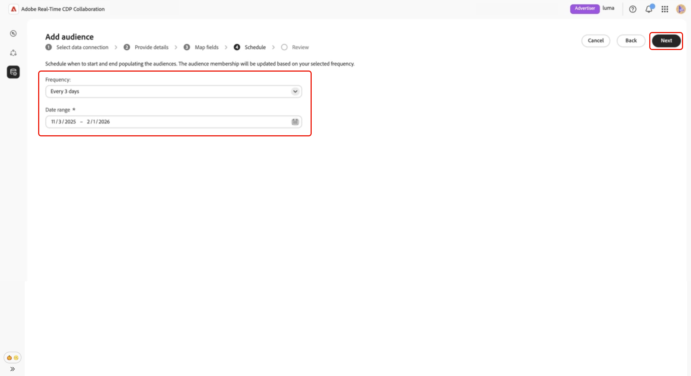

# Configurar [!DNL Amazon S3] para el abastecimiento de audiencia

Obtenga información sobre cómo configurar y conectar su almacenamiento de [!DNL Amazon S3] en la interfaz de usuario de Adobe Real-Time CDP Collaboration a los datos de audiencia de origen para su activación y análisis de superposición.

>[!IMPORTANT]
>
>Antes de seguir esta guía, debe haber completado los pasos para autorizar la función IAM de Adobe en su cuenta de AWS.\
>Consulte la guía **[Configuración de permisos de AWS para el abastecimiento de audiencias](./configure-aws-permissions-audience-sourcing.md)** para obtener instrucciones de configuración detalladas.

## Información general {#overview}

Utilice este flujo de trabajo para obtener y administrar audiencias de origen directamente desde [!DNL Amazon S3]. Después de la configuración, Collaboration obtiene automáticamente las audiencias de su S3 bucket y las pone a disposición para su información y activación.

Las audiencias obtenidas a través de S3 siguen las mismas reglas de gobernanza y gestión de datos que las obtenidas de Adobe Experience Platform.

## Requisitos previos {#prerequisites}

Antes de configurar la conexión de datos de S3, asegúrese de lo siguiente:

* Tiene acceso a un bloque **[!DNL Amazon S3]activo** que contiene archivos de audiencia que se ajustan a la **[especificación de fuentes de audiencia (v1.1)](../../assets/quick-start/RTCDP_Collaboration_Audience_Sourcing_Spec_v1.2.pdf)**.
* Ha creado un **rol de IAM** en AWS que concede permiso a Adobe para acceder a su bloque mediante el método **rol asumido** (no claves de acceso/secretas). Consulte **[Configuración de permisos de AWS para el abastecimiento de audiencias](./configure-aws-permissions-audience-sourcing.md)** para obtener instrucciones detalladas. La función IAM debe incluir los siguientes permisos:

   * `ListBucket`
   * `GetBucketLocation`
   * `GetObject`

* Tiene preparados los siguientes valores:

   * **Nombre de recurso de Amazon (ARN) de rol de IAM**
   * **Nombre del contenedor S3**
   * **Ruta de la carpeta** (el prefijo del directorio que contiene los archivos de audiencia)

>[!NOTE]
>
>Los archivos de audiencia deben encontrarse en la **ruta de la carpeta raíz** de su espacio autorizado de S3. No se admiten estructuras de subcarpetas.

## Configurar su conexión de [!DNL Amazon S3] {#configure-aws-s3-connection}

En la ficha **[!UICONTROL Mis audiencias]** del área de trabajo **[!UICONTROL Configuración]**, seleccione el icono de agregar () y luego seleccione **[!UICONTROL Audiencia]**.

Si esta es su primera audiencia, también puede seleccionar la opción **[!UICONTROL Agregar]**.

**&#x200B;**&#x200B;**&#x200B;**

{zoomable="yes"}

### [!DNL Amazon S3] {#select-aws-s3}

**&#x200B;**&#x200B;**&#x200B;**

![[!DNL Amazon S3]](../../assets/setup/aws-audience-sourcing/select-s3-data-connection.png)

### Revisar los requisitos de archivo del público {#review-audience-requirements}

>[!CONTEXTUALHELP]
>id="rtcdp_collaboration_audience_sourcing_specifications"
>title="Preparar los datos para la incorporación"
>abstract="Lea la guía de especificación de fuentes de públicos para aprender a dar formato y estructurar los datos de público de Amazon S3 para Collaboration."
>additional-url="https://www.adobe.com/go/rtcdp-collaboration-audience-sourcing" text="Consulte la guía"

**[&#128279;](../../assets/quick-start/RTCDP_Collaboration_Audience_Sourcing_Spec_v1.2.pdf)**&#x200B;[!DNL Amazon S3]

>[!IMPORTANT]
>
>[!DNL Amazon S3]&#x200B;[!DNL Amazon S3]

Your audience files must comply with the Audience Sourcing Specification. The match keys are automatically mapped based on the required format.

Key considerations include:

* `|`
* If uploading multiple files, ensure all files contain identical columns.
* `AUDIENCE_ID` `HASHED_EMAIL_SHA_256` `HASHED_PHONE_SHA_256` `HASHED_IPV4_SHA_256` `CRM_ID` `LOYALTY_ID` `ADFIXUS_ID`
* Data refreshes occur every 1–6 days based on your selection during the sourcing setup in Collaboration.

### Autenticación de la conexión S3 {#authenticate-s3-connection}

>[!CONTEXTUALHELP]
>id="rtcdp_collaboration_sources_s3_folderpath"
>title="Formato de la ruta de la carpeta"
>abstract="Escriba la ruta de la carpeta (prefijo) dentro del bloque [!DNL Amazon S3] donde se almacenan los archivos del público. <ul><li>No inicie las rutas con una barra inclinada (/).</li><li>No incluya una barra inclinada al final de la ruta.</li><ul> Ejemplo válido: `base/path/` Ejemplo no válido: `/base/path`"

>[!CONTEXTUALHELP]
>id="rtcdp_collaboration_audience_sharing_amazon_s3"
>title="Añadir público para Amazon S3"
>abstract="Para conectar su almacenamiento de Amazon S3, autorice al usuario de servicio de Adobe para que recupere sus datos de público para procesarlos. Siga los pasos que se describen en Experience League para conceder acceso a Adobe a su almacenamiento de Amazon S3."

[!DNL Amazon S3]

**[&#128279;](./configure-aws-permissions-audience-sourcing.md)**&#x200B;[!DNL Amazon S3]

* Función IAM
* S3 Bucket Name
* Folder Path

![[!DNL Amazon S3]](../../assets/setup/aws-audience-sourcing/s3-authentication-credentials-form.png)

### Confirm consent acknowledgment {#confirm-consent}

**&#x200B;**

### Validate authentication results {#validate-authentication}

After connecting, the system validates your credentials and displays one of the following messages:

| Estado | Mensaje | Descripción |
|---| ---|---|
| **Correcto** | **&#x200B;**&#x200B;| [!DNL Amazon S3] |
| **Fallido** | **&#x200B;**&#x200B;| Please review your credentials and try again. |
| **&#x200B;**&#x200B;| **&#x200B;**&#x200B;| [!DNL Amazon S3] |
| **&#x200B;**&#x200B;| **&#x200B;**&#x200B;| The audience data doesn&#39;t match the expected structure. Please ensure your files comply with the Audience Sourcing Specifications. |
| **&#x200B;**&#x200B;| **&#x200B;**&#x200B;| Please confirm that your audience files exist in the specified folder path and that the path is accessible. |
| **&#x200B;**&#x200B;| **&#x200B;**&#x200B;| Inténtelo de nuevo.  |

### Provide connection details {#provide-connection-details}

Enter a descriptive name and optional description for your S3 data connection. Input your values into the following UI fields:

* **&#x200B;**
* **&#x200B;**

### Review auto-mapped identity fields {#auto-mapped-fields}

**&#x200B;**

**&#x200B;**

### Schedule refresh frequency and date range {#schedule-refresh}

**&#x200B;**

>[!IMPORTANT]
>
>To manage your Collaboration credits effectively, set the refresh frequency to match or exceed the update frequency of your underlying S3 data. The minimum supported refresh interval is once every six days.

### Review and complete the connection {#review-and-complete}

Finally, review your configuration settings in the summary screen. This view contains a summary of the following sections:

* **&#x200B;**
* **&#x200B;**
* **&#x200B;**`HASHED_EMAIL`
* **&#x200B;**

**&#x200B;**

A dialog confirmation appears stating that the data connection was created successfully and that audience sourcing in progress.

## Review sourced audiences {#review-sourced-audiences}

[!DNL Amazon S3]&#x200B;**&#x200B;**

If audience sourcing is in progress, a banner appears at the top of the screen. Individual audiences appear only after sourcing completes.

![[!DNL Amazon S3]](../../assets/setup/aws-audience-sourcing/s3-audiences-sourcing-in-progress.png)

Once the S3 audiences are sourced, your list of available audiences are provided in a tabulated or card view.

>[!TIP]
>
>**&#x200B;**

**&#x200B;**

**&#x200B;**&#x200B;**&#x200B;**&#x200B;**&#x200B;**&#x200B;**&#x200B;**

Use this view to confirm audience configuration and visibility settings before using the audience in collaboration projects.

[&#128279;](https://experienceleague.adobe.com/en/docs/real-time-cdp-collaboration/using/setup/onboard-audiences#view-audiences-dashboard)

## View your S3 data connection {#view-s3-connection}

[!DNL Amazon S3]&#x200B;**&#x200B;**

Your S3 data connection includes the same functionality and details as other audience data connections, except that you cannot add or edit audiences directly from this view.

>[!NOTE]
>
>[!DNL Amazon S3]

![[!DNL Amazon S3]](../../assets/setup/aws-audience-sourcing/s3-data-connections-tab.png)

## Próximos pasos {#next-steps}

[!DNL Amazon S3]

**&#x200B;**&#x200B;[&#128279;](./onboard-audiences.md)
