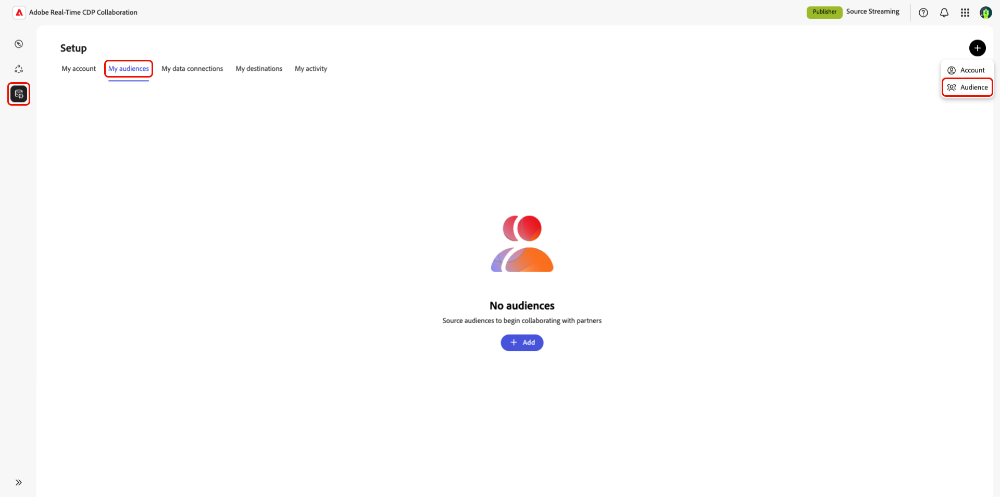

# Configurar [!DNL Amazon S3] para el abastecimiento de audiencia

Obtenga información sobre cómo configurar y conectar su almacenamiento de [!DNL Amazon S3] en la interfaz de usuario de Adobe Real-Time CDP Collaboration a los datos de audiencia de origen para su activación y análisis de superposición.

>[!IMPORTANT]
>
>Antes de seguir esta guía, debe haber completado los pasos para autorizar la función IAM de Adobe en su cuenta de AWS.\
>Consulte la guía **[Configuración de permisos de AWS para el abastecimiento de audiencias](./configure-aws-permissions-audience-sourcing.md)** para obtener instrucciones de configuración detalladas.

## Información general {#overview}

Utilice este flujo de trabajo para obtener y administrar audiencias de origen directamente desde [!DNL Amazon S3]. Después de la configuración, Collaboration obtiene automáticamente las audiencias de su S3 bucket y las pone a disposición para su información y activación.

Las audiencias obtenidas a través de S3 siguen las mismas reglas de gobernanza y gestión de datos que las obtenidas de Adobe Experience Platform.

## Requisitos previos {#prerequisites}

Antes de configurar la conexión de datos de S3, asegúrese de lo siguiente:

* Tiene acceso a un bloque **[!DNL Amazon S3]activo** que contiene archivos de audiencia que se ajustan a la **[especificación de fuentes de audiencia (v1.1)](../../assets/quick-start/RTCDP_Collaboration_Audience_Sourcing_Spec_v1.1.pdf)**.
* Ha creado un **rol de IAM** en AWS que concede permiso a Adobe para acceder a su bloque mediante el método **rol asumido** (no claves de acceso/secretas). Consulte **[Configuración de permisos de AWS para el abastecimiento de audiencias](./configure-aws-permissions-audience-sourcing.md)** para obtener instrucciones detalladas. La función IAM debe incluir los siguientes permisos:

   * `ListBucket`
   * `GetBucketLocation`
   * `GetObject`

* Tiene preparados los siguientes valores:

   * **Nombre de recurso de Amazon (ARN) de rol de IAM**
   * **Nombre del contenedor S3**
   * **Ruta de la carpeta** (el prefijo del directorio que contiene los archivos de audiencia)

>[!NOTE]
>
>Los archivos de audiencia deben encontrarse en la **ruta de la carpeta raíz** de su espacio autorizado de S3. No se admiten estructuras de subcarpetas.

## Configurar su conexión de [!DNL Amazon S3] {#configure-aws-s3-connection}

En la ficha **[!UICONTROL Mis audiencias]** del área de trabajo **[!UICONTROL Configuración]**, seleccione el icono Agregar () y luego seleccione **[!UICONTROL Audiencia]**.

Si esta es su primera audiencia, también puede seleccionar la opción **[!UICONTROL Agregar]**.

Aparecerá el flujo de trabajo Añadir audiencia. Seleccione **[!UICONTROL Agregar una nueva conexión de datos]** y, a continuación, seleccione **[!UICONTROL Siguiente]**.

{zoomable="yes"}

### Seleccione [!DNL Amazon S3] como conexión de datos {#select-aws-s3}

Seleccione **[!UICONTROL Amazon S3]** como conexión de datos, seguido de **[!UICONTROL Siguiente]**.

![La pantalla de selección de conexión de datos con [!DNL Amazon S3] está disponible como opción seleccionable.](../../assets/setup/aws-audience-sourcing/select-s3-data-connection.png)

### Revisar requisitos de archivos de audiencia {#review-audience-requirements}

>[!CONTEXTUALHELP]
>id="rtcdp_collaboration_audience_sourcing_specifications"
>title="Preparar los datos para la incorporación"
>abstract="Lea la guía de especificación de fuentes de audiencias para aprender a dar formato y estructurar los datos de audiencia de Amazon S3 para Collaboration."
>additional-url="https://www.adobe.com/go/rtcdp-collaboration-audience-sourcing" text="Consulte la guía"

Aparecerá un cuadro de diálogo que explica cómo se deben estructurar los archivos de audiencia. Use el vínculo a **[[!UICONTROL Especificación de fuentes de audiencia]](../../assets/quick-start/RTCDP_Collaboration_Audience_Sourcing_Spec_v1.1.pdf)** para aprender a dar formato y estructurar los datos de audiencia de [!DNL Amazon S3] para que Collaboration los lea correctamente.

>[!IMPORTANT]
>
>Debe tener Adobe autorizado como usuario de [!DNL Amazon S3] para que Adobe pueda recuperar datos de su almacenamiento de [!DNL Amazon S3] para su procesamiento.

Los archivos de audiencia deben cumplir con la Especificación del Abastecimiento de audiencias. Las claves de coincidencia se asignan automáticamente según el formato requerido.

Las consideraciones clave incluyen:

* Los archivos deben estar en formato CSV, con comas como delimitadores y barras verticales (`|`) para varios valores.
* Si carga varios archivos, asegúrese de que todos los archivos contengan columnas idénticas.
* Cada registro de audiencia debe incluir `AUDIENCE_ID` y al menos una clave de coincidencia, como `HASHED_EMAIL_SHA_256`, `HASHED_PHONE_SHA_256`, `HASHED_IPV4_SHA_256`, `CRM_ID`, `LOYALTY_ID` o `ADFIXUS_ID`.
* Las actualizaciones de datos se producen cada 1 a 6 días, según la selección realizada durante la configuración de abastecimiento en Collaboration.

### Autenticación de la conexión S3 {#authenticate-s3-connection}

>[!CONTEXTUALHELP]
>id="rtcdp_collaboration_sources_s3_folderpath"
>title="Formato de ruta de carpeta"
>abstract="Escriba la ruta de la carpeta (prefijo) dentro del bloque [!DNL Amazon S3] donde se almacenan los archivos de audiencia. <ul><li>No inicie las rutas con una barra diagonal (/).</li><li>Incluya una barra diagonal al final de la ruta.</li><ul> Ejemplo válido: `base/path/` Ejemplo no válido: `/base/path`"

>[!CONTEXTUALHELP]
>id="rtcdp_collaboration_audience_sharing_amazon_s3"
>title="Añadir audiencia para Amazon S3"
>abstract="Para conectar su almacenamiento de Amazon S3, autorice al usuario de servicio de Adobe a recuperar sus datos de audiencia para procesarlos. Siga los pasos descritos en Experience League para conceder acceso a Adobe a su almacenamiento de Amazon S3."

A continuación, proporcione sus credenciales de [!DNL Amazon S3] para conectar su compartimento de S3 a Collaboration.

Siga los pasos descritos en **[Configuración de permisos de AWS para el abastecimiento de audiencias](./configure-aws-permissions-audience-sourcing.md)** para conceder acceso a Adobe a su
Almacenamiento de [!DNL Amazon S3]. Una vez finalizado, introduzca los valores en los siguientes campos de la interfaz de usuario:

* Función IAM
* Nombre de S3 Bucket
* Ruta de carpeta

![Formulario de conexión [!DNL Amazon S3] con campos para el rol IAM, el nombre del contenedor S3 y la ruta de acceso a la carpeta.](../../assets/setup/aws-audience-sourcing/s3-authentication-credentials-form.png)

### Confirmar confirmación de consentimiento {#confirm-consent}

Debe reconocer que se han eliminado las exclusiones de consentimiento antes de continuar. Marque la casilla de confirmación seguida de **[!UICONTROL OK]** para confirmar.

### Validar resultados de autenticación {#validate-authentication}

Después de conectarse, el sistema valida las credenciales y muestra uno de los mensajes siguientes:

| Estado | Mensaje | Descripción |
|---| ---|---|
| **Correcto** | **[!UICONTROL Autenticación correcta]** | Su conexión con [!DNL Amazon S3] se ha establecido correctamente. |
| **Fallido** | **[!UICONTROL Error de autenticación]** | Revise sus credenciales e inténtelo de nuevo. |
| **Acceso denegado** | **[!UICONTROL Acceso denegado]** | Sus credenciales no tienen los permisos requeridos para acceder a este bloque de [!DNL Amazon S3]. Compruebe la configuración de acceso o póngase en contacto con el administrador. |
| **Formato de archivo no válido** | **[!UICONTROL Formato de archivo no válido]** | Los datos de la audiencia no coinciden con la estructura esperada. Asegúrese de que los archivos cumplan las especificaciones de fuentes de audiencia. |
| **No se encontraron archivos de audiencia** | **[!UICONTROL No se encontraron archivos de audiencia]** | Confirme que los archivos de audiencia existen en la ruta de carpeta especificada y que se puede acceder a ella. |
| **Error interno** | **[!UICONTROL Se produjo un error interno]** | Inténtelo de nuevo. Si el problema persiste, póngase en contacto con el servicio de atención al cliente. |

### Proporcionar detalles de conexión {#provide-connection-details}

Introduzca un nombre descriptivo y una descripción opcional para la conexión de datos S3. Introduzca sus valores en los siguientes campos de la interfaz de usuario:

* **[!UICONTROL Nombre de conexión de datos]** (obligatorio)
* **[!UICONTROL Descripción de la conexión de datos]** (opcional)

### Revisar los campos de identidad asignados automáticamente {#auto-mapped-fields}

La pantalla **[!UICONTROL Mapping]** es de solo lectura. No se pueden agregar, eliminar ni aplicar transformaciones. Collaboration asigna automáticamente los campos de identidad de origen de los archivos de audiencia a los campos de destino según la especificación de fuente de audiencias.

Confirme visualmente los campos asignados y seleccione **[!UICONTROL Siguiente]** para continuar.

### Frecuencia de actualización de programación e intervalo de fechas {#schedule-refresh}

Aparece la vista **[!UICONTROL Programar]**. Utilice el menú desplegable para seleccionar una frecuencia de actualización entre uno y seis días y, a continuación, establezca el intervalo de fechas activo. Utilice el icono de calendario para especificar las fechas de inicio y finalización.

>[!IMPORTANT]
>
>Para administrar los créditos de Collaboration de forma eficaz, configure la frecuencia de actualización para que coincida o exceda la frecuencia de actualización de los datos de S3 subyacentes. El intervalo mínimo de actualización admitido es de una vez cada seis días.

### Revisión y finalización de la conexión {#review-and-complete}

Por último, revise los ajustes de configuración en la pantalla de resumen. Esta vista contiene un resumen de las secciones siguientes:

* **[!UICONTROL Conexión de datos]**: Muestra el rol de IAM, el nombre del contenedor S3 y la ruta de la carpeta que configuró.
* **[!UICONTROL Detalles]**: muestra el nombre y la descripción opcional de la conexión de datos para ayudar a identificarla más adelante.
* **[!UICONTROL Asignación]**: detalla cómo se asignan los campos de origen de los archivos de audiencia cargados (por ejemplo, `HASHED_EMAIL`) a los campos de destino utilizados en Collaboration (por ejemplo, correo electrónico con hash).
* **[!UICONTROL Programación]**: Resume la frecuencia con la que la conexión actualiza los datos de audiencia y el intervalo de fechas activo para el abastecimiento.

Seleccione el icono de lápiz si necesita editar una sección. Seleccione **[!UICONTROL Completar]** para confirmar todas las secciones.

Aparecerá un cuadro de diálogo de confirmación que indica que la conexión de datos se ha creado correctamente y que el abastecimiento de la audiencia está en curso.

## Revisar audiencias de origen {#review-sourced-audiences}

Después de completar la configuración, Collaboration comienza a obtener audiencias de su S3 bucket. Las audiencias que provienen de un bloque de [!DNL Amazon S3] aparecen en la pestaña **[!UICONTROL Mis audiencias]** y tienen la misma funcionalidad e información que las audiencias que provienen de Experience Platform.

Si el abastecimiento de la audiencia está en curso, aparece un banner en la parte superior de la pantalla. Las audiencias individuales aparecen solo después de que se complete el abastecimiento.

![La pestaña Audiencias muestra que el abastecimiento está en curso para [!DNL Amazon S3] audiencias.](../../assets/setup/aws-audience-sourcing/s3-audiences-sourcing-in-progress.png)

Una vez obtenidas las audiencias S3, la lista de audiencias disponibles se proporciona en una vista tabulada o con tarjeta.

>[!TIP]
>
>El tiempo de obtención de la audiencia varía en función del tamaño de los datos de S3 y de la frecuencia de actualización que haya configurado. Es posible que los conjuntos de datos más grandes o las programaciones de actualización menos frecuentes tarden más en aparecer en el área de trabajo **[!UICONTROL Mis audiencias]**.

En la vista de cuadrícula o en la vista de tabla, seleccione un elemento de fila o **[!UICONTROL Ver audiencia]** para ver una descripción general de una audiencia específica. Muestra el estado de la audiencia, el origen y el nombre de la conexión de datos, junto con paneles detallados para:

**[!UICONTROL Identidades]**: muestra el recuento total de identidades y el desglose una vez que los datos estén disponibles.
**[!UICONTROL Categorías]**: enumera todas las etiquetas utilizadas para organizar o filtrar la audiencia.
**[!UICONTROL Acceso a la conexión]**: indica si la audiencia es privada, pública o compartida con colaboradores específicos.
**[!UICONTROL Visibilidad de metadatos]**: Define qué información de audiencia (como recuento de identidades, porcentaje de superposición e índice) es visible para los colaboradores.

Utilice esta vista para confirmar los ajustes de configuración de audiencia y visibilidad antes de utilizar la audiencia en proyectos de colaboración.

Consulte la [documentación del panel de vista de audiencias](https://experienceleague.adobe.com/es/docs/real-time-cdp-collaboration/using/setup/onboard-audiences#view-audiences-dashboard) para obtener más información.

## Visualización de la conexión de datos de S3 {#view-s3-connection}

La conexión [!DNL Amazon S3] que acaba de agregar está disponible de inmediato en la ficha **[!UICONTROL Mis conexiones de datos]**. El origen de la audiencia se muestra como [!UICONTROL Amazon S3].

La conexión de datos de S3 incluye la misma funcionalidad y detalles que otras conexiones de datos de audiencia, excepto que no puede agregar ni editar audiencias directamente desde esta vista.

>[!NOTE]
>
>[!DNL Amazon S3] conexiones de datos no se pueden editar. Una vez creada la conexión, no se puede modificar la configuración, como la frecuencia de actualización. Para actualizar la configuración, debe eliminar la conexión existente y crear una nueva.

![La ficha Mis conexiones de datos muestra la conexión de datos [!DNL Amazon S3] con la información de estado de abastecimiento.](../../assets/setup/aws-audience-sourcing/s3-data-connections-tab.png)

## Próximos pasos {#next-steps}

Ahora ha configurado y conectado correctamente su almacenamiento de [!DNL Amazon S3] como origen de datos en Collaboration. Al completar este flujo de trabajo, habilitó el abastecimiento seguro de datos de audiencia de origen para la activación y el análisis de superposición.

Una vez finalizado el abastecimiento, las audiencias aparecerán en el área de trabajo **[!UICONTROL Mis audiencias]**, listas para la colaboración y la activación. Para obtener opciones de administración detalladas, consulte la [documentación de origen y administración de audiencias](./onboard-audiences.md).
