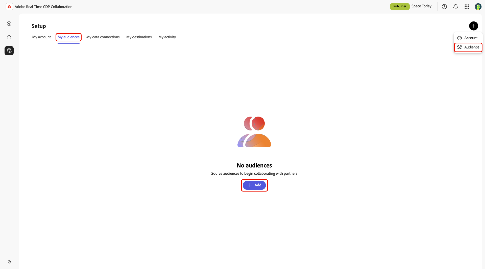
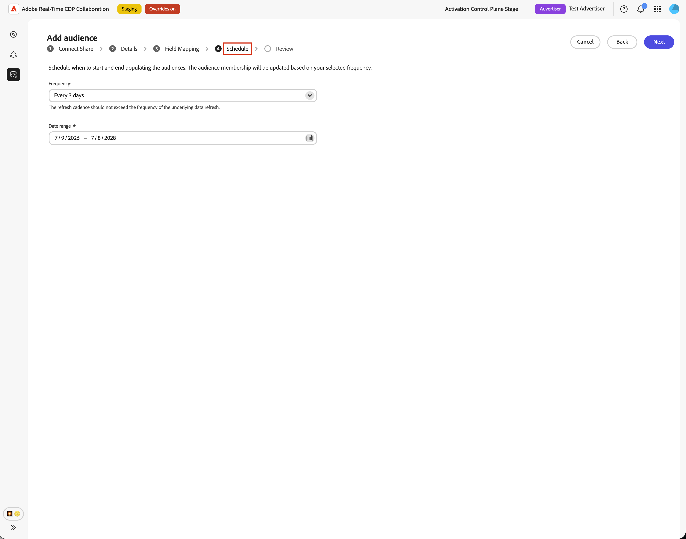
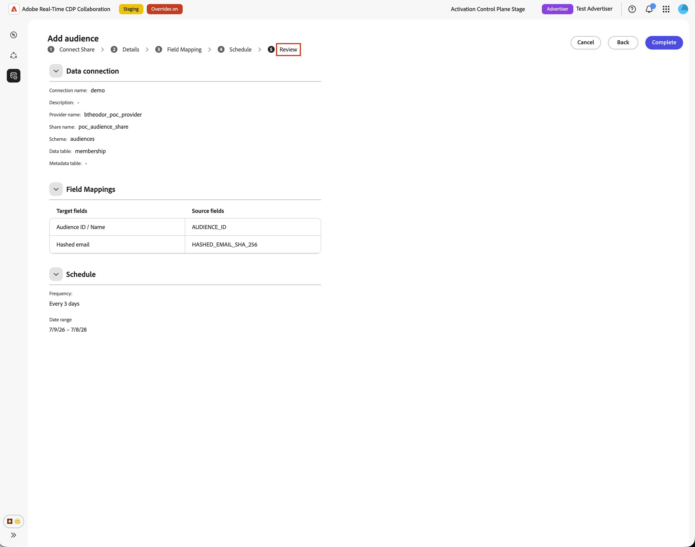
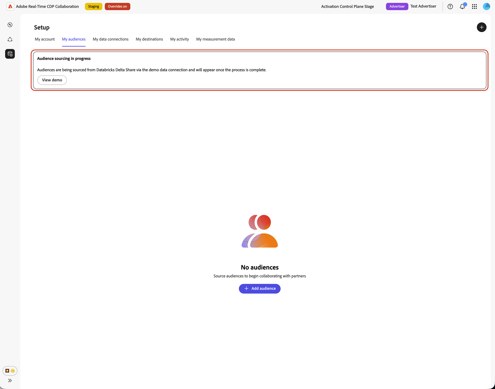
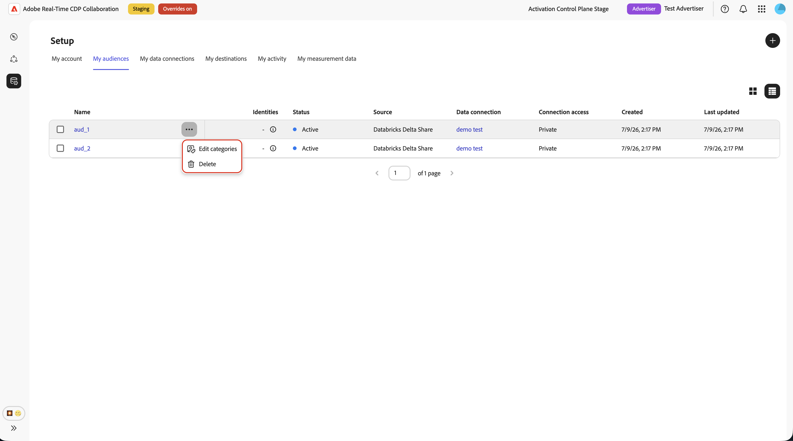

# Configurar [!DNL Databricks Delta Share] para el abastecimiento de audiencia

Utilice esta guía para conectar [!DNL Databricks Delta Share] a Adobe Real-Time CDP Collaboration y obtener audiencias de origen a través de la interfaz de usuario.

Al conectar [!DNL Databricks Delta Share], Collaboration lee los datos de audiencia directamente desde el recurso compartido del catálogo Unity. Una vez finalizado el abastecimiento, puede utilizar las audiencias para la activación y el análisis de superposición en proyectos de colaboración.

En esta guía se explica cómo preparar los requisitos previos, conectar [!DNL Delta Share], especificar tablas de origen, asignar campos de identidad y comprobar que el abastecimiento de audiencias se inicia correctamente.

Las audiencias procedentes de [!DNL Databricks] siguen las mismas reglas de gobernanza y administración de datos que las audiencias procedentes de Adobe Experience Platform y otras fuentes de nube compatibles.

Otros métodos de abastecimiento disponibles son [Experience Platform](./onboard-audiences.md), [Amazon S3](./configure-aws-s3-audience-sourcing.md), [Google Cloud Storage](./configure-gcs-audience-sourcing.md), [Snowflake](./configure-snowflake-audience-sourcing.md), [Azure Storage](./configure-azure-storage-audience-sourcing.md) y [CSV file upload](./upload-csv-audience-sourcing.md). Para obtener más información sobre todos los orígenes disponibles en Collaboration, consulte [Resumen de orígenes](./source-overview.md).

## Requisitos previos {#prerequisites}

Complete los requisitos previos de esta sección antes de iniciar el flujo de trabajo de configuración. La falta de requisitos previos es una razón común por la que la configuración falla o las audiencias no aparecen después del abastecimiento. Antes de seguir esta guía, complete la [incorporación y configuración de la cuenta](./onboard-account.md).

Algunas tareas de esta guía requieren la ayuda de un administrador de [!DNL Databricks]. Si no administra [!DNL Databricks] para su organización, trabaje con el administrador apropiado antes de comenzar.

### Acceso de [!DNL Databricks Delta Share] {#databricks-delta-share-access}

Antes de continuar, confirme lo siguiente con su administrador de [!DNL Databricks]:

* Su organización ha publicado un(a) [!DNL Delta Share] en la cuenta [!DNL Databricks] de Adobe mediante el uso compartido nativo de Databricks-to-Databricks (catálogo Unity). Collaboration no admite la entrada de credenciales de token de portador o de OIDC en la interfaz de usuario para este flujo de trabajo.
* Sabe que el nombre del proveedor está registrado en el metaalmacén Unity Catalog de Adobe, el nombre del recurso compartido y el esquema que contiene las tablas de audiencia.
* El abastecimiento de audiencia [!DNL Databricks Delta Share] está disponible para su cuenta y región de Collaboration. Si el abastecimiento de Databricks aún no está disponible en su región, póngase en contacto con su representante de cuentas de Adobe para confirmar una cronología.

Para obtener instrucciones paso a paso sobre cómo publicar un recurso compartido en Adobe, consulte la sección [Publicar el recurso compartido Delta en Adobe](#publish-delta-share) en esta guía.

### Preparación de los datos de audiencia {#prepare-audience-data}

Estructurar las tablas de audiencias para que Collaboration pueda detectar audiencias y asignar identidades correctamente.

* **Tabla de pertenencia (obligatoria):** Una tabla del esquema compartido que contiene una fila por par de perfil-audiencia. Esta tabla debe incluir una columna que se pueda asignar a `AUDIENCE_ID` y al menos una columna de clave de coincidencia admitida. Collaboration utiliza esta tabla para la vista previa de datos de origen y la asignación de campos.
* **Tabla de metadatos (opcional):** Si mantiene un catálogo independiente de audiencias (una fila por audiencia con ID de audiencia, nombre, recuentos o metadatos similares), puede proporcionar esta tabla para que Collaboration lea las definiciones de audiencia de ella en lugar de inferir ID de audiencia distintos únicamente de la tabla de pertenencia.
* **Claves de coincidencia admitidas:** `HASHED_EMAIL_SHA_256`, `HASHED_PHONE_SHA_256`, `HASHED_IPV4_SHA_256`, `CRM_ID`, `LOYALTY_ID`, `ADFIXUS_ID` y otras claves de coincidencia habilitadas para su cuenta de Collaboration.
* **Requisitos de hash:** Todos los valores de clave de coincidencia deben estar recortados, en minúsculas y con hash SHA256 antes de almacenarse en [!DNL Databricks]. Collaboration no hash ni normaliza los datos antes de la ingesta.
* **Coherencia de columna:** La tabla de pertenencia debe exponer nombres de columna estables que Collaboration pueda asignar a las claves de coincidencia habilitadas.

Todas las claves de coincidencia presentes en la tabla de pertenencia también deben habilitarse para la cuenta de Collaboration. Para agregar o habilitar claves de coincidencia, consulte [Configurar claves de coincidencia](./onboard-account.md#set-up-match-keys).

### Valores necesarios antes de comenzar {#required-values}

Tenga preparados los siguientes valores antes de iniciar el asistente de configuración.

| Valor | Descripción |
| ----- | ----------- |
| Nombre del proveedor | Identificador de proveedor que Adobe usa en el catálogo Unity para obtener acceso a [!DNL Delta Share]. El administrador de [!DNL Databricks] o el contacto de incorporación de Adobe pueden proporcionar este valor. Este valor no es el mismo que la dirección URL del área de trabajo [!DNL Databricks]. |
| Compartir nombre | Nombre de [!DNL Delta Share] publicado en Adobe. |
| Esquema | El esquema del recurso compartido que contiene las tablas de audiencia. |
| Tabla de abono | El nombre de tabla dentro del esquema que contiene filas de miembros de audiencia (una fila por perfil en una audiencia). |
| Tabla de metadatos (opcional) | El nombre de la tabla dentro del esquema que enumera las audiencias (una fila por audiencia), si utiliza un catálogo de audiencias impulsado por metadatos. |

{style="table-layout:auto"}

## Configurar su conexión de [!DNL Databricks] {#configure-databricks-connection}

El flujo de trabajo de configuración es un asistente de varios pasos dentro del área de trabajo **[!UICONTROL Setup]**. Complete cada paso de forma secuencial.

### Añadir una nueva conexión de datos {#add-data-connection}

En la ficha **[!UICONTROL Mis audiencias]** del área de trabajo **[!UICONTROL Configuración]**, seleccione el icono de agregar () y luego seleccione **[!UICONTROL Audiencia]**.

Si esta es su primera audiencia, también puede seleccionar la opción **[!UICONTROL Agregar]**.

Aparecerá el flujo de trabajo Añadir audiencia. Seleccione **[!UICONTROL Agregar una nueva conexión de datos]** y, a continuación, seleccione **[!UICONTROL Siguiente]**.

{zoomable="yes"}

### Seleccionar [!DNL Databricks Delta Share] como la fuente de datos {#select-databricks-delta-share}

La pantalla de selección de fuentes de datos enumera todos los tipos de conexión disponibles. Seleccione **[!UICONTROL Recurso compartido delta de Databricks]** y, a continuación, seleccione **[!UICONTROL Siguiente]**.

### Conectar su [!DNL Delta Share] {#connect-delta-share}

>[!CONTEXTUALHELP]
>id="rtcdp_collaboration_audience_sharing_databricks"
>title="Experience League"
>abstract="Consulte la guía de abastecimiento de [!DNL Databricks Delta Share] para obtener instrucciones sobre cómo configurar su recurso compartido para el abastecimiento de audiencias"

Proporcione los detalles necesarios para permitir que Collaboration acceda a su [!DNL Delta Share]. Escriba los detalles del proveedor, recurso compartido, esquema y tabla de su [!DNL Databricks Delta Share]. La tabla de pertenencia necesaria debe estar disponible en el esquema compartido. Si utiliza una tabla de metadatos, también debe estar disponible en el mismo esquema compartido.
Después de especificar la información requerida, seleccione **[!UICONTROL Conectar]**.

Collaboration valida el recurso compartido y lo monta en el espacio de trabajo de Adobe. Este paso puede tardar hasta un minuto. Aparecerá un indicador de progreso mientras se establece la conexión.

| Campo | Descripción |
| --- | --- |
| **[!UICONTROL Nombre de proveedor]** | El nombre del proveedor del catálogo Unity que Adobe utiliza para consumir su recurso compartido. Consulte [Valores necesarios antes de comenzar](#required-values). |
| **[!UICONTROL Nombre para compartir]** | Nombre de [!DNL Delta Share] publicado en Adobe. |
| **[!UICONTROL Esquema]** | El esquema del recurso compartido que contiene las tablas de audiencia. |
| **[!UICONTROL Tabla de datos]** | El nombre de tabla dentro del esquema que contiene filas de miembros de audiencia (una fila por perfil en una audiencia). |
| **[!UICONTROL Tabla de metadatos]** | La tabla que enumera las audiencias (una fila por audiencia). |

Si no se encuentra el recurso compartido o el esquema aún no está visible, aparecerá un mensaje de error. Compruebe los valores con su administrador de [!DNL Databricks] e inténtelo de nuevo.

### Confirmar el consentimiento y el reconocimiento de uso de datos {#confirm-consent}

Antes de continuar, confirme que ha aplicado cualquier exclusión requerida por la ley a los datos de audiencia que envía a Collaboration. Si no está seguro de si sus datos cumplen con este requisito, revise la guía de [directiva de gobernanza y acciones de aplicación](./onboard-audiences.md#governance-policy-and-enforcement-actions) antes de continuar. Seleccione la casilla de verificación de confirmación y, a continuación, seleccione **[!UICONTROL Aceptar]** para continuar.

### Proporcionar detalles de conexión {#provide-connection-details}

Escriba un nombre y una descripción opcional para esta conexión de datos. El nombre que proporcione aparecerá en la ficha **[!UICONTROL Mis conexiones de datos]** y le ayudará a distinguir esta fuente si administra varias conexiones de datos.

* **[!UICONTROL Nombre de conexión de datos]** (obligatorio)
* **[!UICONTROL Descripción de la conexión de datos]** (opcional)

Haga clic en **[!UICONTROL Siguiente]** para continuar.

### Asignar campos de identidad {#map-identity-fields}

La pantalla **[!UICONTROL Mapping]** muestra cómo Collaboration asigna las columnas de origen de la tabla de pertenencia a los campos de identidad de destino. Collaboration asigna los campos automáticamente en función de los nombres de columna y las claves de coincidencia habilitadas para la cuenta.

>[!TIP]
>
>Seleccione **[!UICONTROL Vista previa de los datos de origen]** para revisar una muestra de su tabla de pertenencia en formato tabular y, a continuación, seleccione **[!UICONTROL Cerrar]** para volver a la pantalla de asignación.

Confirme que las asignaciones mostradas reflejan las columnas de la tabla de pertenencia. Haga clic en **[!UICONTROL Siguiente]** para continuar.

### Frecuencia de actualización de programación e intervalo de fechas {#schedule-refresh}

Aparece la vista **[!UICONTROL Programar]**. Utilice el menú desplegable para seleccionar una frecuencia de actualización entre uno y seis días y, a continuación, establezca el intervalo de fechas activo. Utilice el icono de calendario para especificar las fechas de inicio y finalización.

>[!IMPORTANT]
>
>Para administrar los créditos de Collaboration de forma eficaz, configure la frecuencia de actualización para que coincida con la frecuencia de actualización de la actualización de datos subyacente o la supere.

### Revisión y finalización de la conexión {#review-and-complete}

Revise el resumen de la configuración antes de crear la conexión. La pantalla de resumen muestra las siguientes secciones:

* **[!UICONTROL Conexión de datos]**: el nombre de la conexión, el nombre del proveedor, el nombre del recurso compartido y el esquema que configuró.
* **[!UICONTROL Asignación]**: Asignaciones de campo de identidad de origen y destino.
* **[!UICONTROL Programación]**: La frecuencia de actualización y el intervalo de fechas activo.

Compruebe que todas las secciones son correctas y, a continuación, seleccione **[!UICONTROL Completar]**.

Aparece un cuadro de diálogo de confirmación que indica que Collaboration ha creado la conexión de datos y que el abastecimiento de audiencias está en curso.

## Revisar audiencias de origen {#review-sourced-audiences}

Después de completar el asistente de configuración, Collaboration empieza a obtener audiencias de las tablas [!DNL Databricks] de forma asíncrona. Vaya a **[!UICONTROL Configuración] > [!UICONTROL Mis audiencias]** para supervisar el progreso. El abastecimiento no se completa inmediatamente; el tiempo necesario depende del tamaño de los datos.

### Monitorización del progreso de abastecimiento de audiencia {#monitor-sourcing-progress}

Mientras Collaboration recupera sus datos de audiencia, un banner en la parte superior de **[!UICONTROL Mis audiencias]** espacio de trabajo indica que el abastecimiento está en curso. Las audiencias individuales aparecen en la lista solo después de que el abastecimiento se complete para cada audiencia.

>[!TIP]
>
>El tiempo de obtención de la audiencia varía en función del tamaño de la tabla de suscripciones y de si utiliza una tabla de metadatos para la detección de audiencias. Los conjuntos de datos más grandes pueden tardar más en aparecer en el espacio de trabajo **[!UICONTROL Mis audiencias]**.

### Ver detalles de la audiencia de origen {#view-audience-details}

Una vez finalizado el abastecimiento, las audiencias de [!DNL Databricks] aparecerán en la pestaña **[!UICONTROL Mis audiencias]** junto con las audiencias procedentes de otras conexiones. Seleccione un elemento de fila o **[!UICONTROL Ver audiencia]** para abrir la vista de detalles de una audiencia específica.

La vista de detalles muestra el estado de la audiencia, el origen y el nombre de la conexión de datos, junto con los siguientes paneles:

* **[!UICONTROL Identidades]**: El recuento total de identidades y el desglose de la audiencia, una vez que los datos estén disponibles.
* **[!UICONTROL Categorías]**: Cualquier etiqueta aplicada para organizar o filtrar la audiencia.
* **[!UICONTROL Acceso a la conexión]**: Indica si la audiencia es privada, pública o compartida con colaboradores específicos.
* **[!UICONTROL Visibilidad de metadatos]**: Qué información de audiencia, como recuento de identidades, porcentaje de superposición e índice, es visible para los colaboradores.

Revise esta configuración antes de usar la audiencia en un proyecto de colaboración. Para actualizar categorías, acceso a conexiones o visibilidad de metadatos, consulte [Ver y administrar audiencias individuales](./onboard-audiences.md#view-individual-audiences).

### Editar configuración de audiencia {#edit-audience-settings}

Puede editar metadatos de audiencia directamente desde la vista de lista **[!UICONTROL Mis audiencias]** sin abrir la vista de detalles. Seleccione la casilla de verificación de una audiencia para mostrar la barra de herramientas de acciones y, a continuación, seleccione una acción: **[!UICONTROL Editar visibilidad de metadatos]**, **[!UICONTROL Editar acceso a la conexión]**, **[!UICONTROL Editar nombre y descripción]**, **[!UICONTROL Editar categorías]** o **[!UICONTROL Eliminar]**.

### Ver su conexión de datos de [!DNL Databricks] {#view-databricks-connection}

Para revisar la propia conexión, incluidas sus claves de coincidencia, vaya a **[!UICONTROL Configuración]** > **[!UICONTROL Mis conexiones de datos]**. Su nueva conexión de [!DNL Databricks] está disponible allí. El origen de la audiencia se muestra como **[!UICONTROL Recurso compartido delta de Databricks]**.

![La ficha Mis conexiones de datos muestra la conexión de datos [!DNL Databricks Delta Share] con la información de estado de abastecimiento.](../../assets/setup/databricks-audience-sourcing/databricks-my-data-connections-tab.png)

## Limitaciones conocidas {#known-limitations}

Tenga en cuenta las siguientes restricciones al configurar y utilizar el abastecimiento de audiencia [!DNL Databricks Delta Share]:

* **Solo uso compartido nativo:** La interfaz de usuario solo admite Databricks-to-Databricks nativos [!DNL Delta Sharing]. Los flujos de autenticación de token de portador y OIDC no están disponibles en el asistente de configuración.
* **No hay ningún explorador de tablas en el asistente:** Debe escribir los nombres de tablas manualmente. Collaboration valida los nombres de las tablas al obtener una vista previa de las tablas; no muestra automáticamente todas las tablas del recurso compartido.
* **Límite de fila de tabla de metadatos:** Cuando se usa una tabla de metadatos para la detección de audiencias, Collaboration importa hasta 100 000 filas de audiencia de esa tabla. Póngase en contacto con el servicio de asistencia técnica de Adobe si el catálogo supera este límite.
* **Restricciones de clave de coincidencia:** Una vez habilitada una clave de coincidencia para una conexión de datos, no se puede quitar. Puede agregar claves de coincidencia a una conexión existente, pero no puede deshabilitarlas ni eliminarlas. Para cambiar las claves de coincidencia activas, debe [eliminar la conexión de datos](./manage-data-connection.md#delete-data-connection) y crear una nueva.
* **Se requiere una tabla de pertenencia:** Incluso cuando utiliza una tabla de metadatos para la detección de audiencias, debe especificar una tabla de pertenencia. Collaboration lee filas de identidad de la tabla de pertenencia durante la ingesta.

## Resolución de problemas {#troubleshooting}

Utilice esta sección para resolver los problemas que se producen durante o después de la configuración. Para detectar errores durante la conexión compartida, revise el nombre del proveedor, el nombre del recurso compartido y el esquema con el administrador de [!DNL Databricks].

**Se produce un error en la conexión compartida o se agota el tiempo de espera**

* Compruebe que su [!DNL Delta Share] se ha publicado en la cuenta [!DNL Databricks] de Adobe y que el nombre del proveedor, el nombre del recurso compartido y el esquema son correctos.
* Confirme que el esquema esté visible en el recurso compartido. Los recursos compartidos recién publicados pueden tardar un tiempo en propagarse.
* Si la conexión sigue fallando después de varios minutos, reinicie el programa de instalación e inténtelo de nuevo, o póngase en contacto con el servicio de atención al cliente de Adobe y proporcione el nombre del proveedor, el nombre del recurso compartido, el esquema y cualquier detalle de error relevante. No incluya credenciales confidenciales.

**Error en la vista previa de tabla**

* Confirme que el nombre de la tabla está escrito correctamente y existe en el esquema especificado.
* Asegúrese de que la tabla esté incluida en [!DNL Delta Share] publicado en Adobe.
* Para la detección controlada por metadatos, obtenga una vista previa de la tabla de suscripciones y de la tabla de metadatos antes de continuar.

**La validación de asignación de campos bloquea el progreso**

* Confirme que la tabla de pertenencia incluye una columna que se puede asignar a **`AUDIENCE_ID`**.
* Asegúrese de que al menos dos campos de identidad estén completamente asignados (origen y destino).
* Use **[!UICONTROL Vista previa de los datos de origen]** para comprobar que los nombres de columna coinciden con las claves de coincidencia habilitadas.

**Las audiencias no aparecen o el abastecimiento está tardando más de lo esperado**

* El abastecimiento se escala con el volumen de datos. Se espera un tiempo de procesamiento más largo para las tablas de abono grandes.
* Si las audiencias no han aparecido en un plazo de 24 horas, consulte la pestaña **[!UICONTROL Mis conexiones de datos]** para ver si hay indicadores de error en la conexión.
* Compruebe que la estructura de la tabla de suscripciones y las asignaciones de campos coinciden con los requisitos de [Prepare los datos de audiencia](#prepare-audience-data).
* Si el problema persiste, póngase en contacto con Atención al cliente de Adobe y proporcione el nombre de la conexión de datos y los detalles de la tabla.

**La conexión de datos muestra un estado de error después de haberse realizado correctamente inicialmente**

* Confirme que [!DNL Delta Share] y las tablas no se han quitado ni cambiado de nombre en [!DNL Databricks] desde que creó la conexión.
* Compruebe que no se ha revocado el acceso de Adobe al recurso compartido.
* Si el problema persiste, póngase en contacto con Atención al cliente de Adobe.

## Publicar su [!DNL Delta Share] en Adobe {#publish-delta-share}

[!DNL Databricks] Unity Catalog [!DNL Delta Sharing] le permite compartir tablas de forma segura con otras cuentas de [!DNL Databricks] sin copiar datos. Para permitir que Collaboration lea sus datos de audiencia, el administrador de [!DNL Databricks] debe publicar un [!DNL Delta Share] en la cuenta de consumidor de [!DNL Databricks] de Adobe.

### Antes de publicar {#before-you-publish}

Póngase en contacto con su representante de cuentas de Adobe o con su contacto de incorporación para obtener lo siguiente:

* Confirmación de que Adobe está listo para recibir su participación en su región.
* El nombre de proveedor que utiliza Adobe en su metaalmacén Unity Catalog para identificar a su organización como proveedor de recursos compartidos.

Prepare lo siguiente en su área de trabajo [!DNL Databricks]:

* Se leerá un [!DNL Delta Share] que contiene el esquema y las tablas de Collaboration.
* Una tabla de pertenencia con una fila por cada par de perfil-audiencia y columnas para **`AUDIENCE_ID`** y claves de coincidencia.
* Una tabla de metadatos opcional si tiene pensado utilizar la detección de audiencias basada en metadatos.

### Publicar el recurso compartido {#publish}

Siga los procedimientos [!DNL Databricks Delta Sharing] de su organización para conceder acceso al recurso compartido a la cuenta de consumidor de Adobe. Los pasos exactos dependen de la implementación de [!DNL Databricks] y del modelo de gobernanza. En general:

1. En Unity Catalog, cree o identifique el recurso compartido que contiene el esquema y las tablas de audiencia.
2. Agregue el esquema (o tablas individuales) al recurso compartido.
3. Conceda el recurso compartido a la cuenta de consumidor [!DNL Databricks] de Adobe mediante el uso compartido nativo entre Databricks y Databricks.
4. Confirme con su contacto de Adobe que el recurso compartido está visible en el lado del consumidor y anote el nombre del proveedor y el nombre del recurso compartido para el asistente de configuración de Collaboration.
5. Para obtener la documentación del producto [!DNL Databricks] en [!DNL Delta Sharing], consulte la [Documentación de uso compartido de delta de Databricks](https://docs.databricks.com/aws/en/delta-sharing).

### Recopilar detalles de [!DNL Databricks] para Collaboration {#collect-databricks-details}

Después de publicar el recurso compartido, asegúrese de que tiene disponibles el nombre del proveedor, el nombre del recurso compartido, el esquema y los nombres de tabla para el flujo de trabajo de configuración de Collaboration.

Reúna los detalles siguientes antes de iniciar el asistente de configuración de Collaboration.

| Campo | Descripción | Ejemplo |
| ------| ----------- | ------- |
| Nombre del proveedor | Identificador de proveedor en el metaalmacén Unity Catalog de Adobe (desde la incorporación de Adobe) | `your_org_provider` |
| Compartir nombre | Nombre del [!DNL Delta Share] publicado | `audience_share_prod` |
| Esquema | Esquema | `collaboration_audiences` |
| Tabla de abono | Tabla con filas de miembros de perfil-audiencia | `audience_members` |
| Tabla de metadatos (opcional) | Tabla con audiencias (una fila por audiencia) | `audience_catalog` |

{style="table-layout:auto"}

## Próximos pasos {#next-steps}

Ha configurado [!DNL Databricks Delta Share] como origen de datos en Collaboration. Una vez finalizado el abastecimiento, las audiencias estarán disponibles en el espacio de trabajo de **[!UICONTROL Mis audiencias]** y listas para usarse en proyectos de colaboración.

Desde ahí, puede realizar lo siguiente:

* [Creación y administración de proyectos de colaboración](../collaborate/manage-projects.md)
* [Activación de audiencias dentro de un proyecto](../collaborate/activate.md)
* [Revisión de superposiciones y medición del rendimiento](../collaborate/measure.md)
* [Administrar la configuración y visibilidad de la audiencia](./onboard-audiences.md#view-individual-audiences)
* [Visualización y administración de conexiones de datos](./manage-data-connection.md)

Para ver otros métodos de obtención de audiencias, consulte:

* [Configurar  [!DNL Google Cloud Storage] para el abastecimiento de audiencias](./configure-gcs-audience-sourcing.md)
* [Configurar  [!DNL Amazon S3] para el abastecimiento de audiencias](./configure-aws-s3-audience-sourcing.md)
* [Configurar  [!DNL Snowflake] para el abastecimiento de audiencias](./configure-snowflake-audience-sourcing.md)
* [Audiencias de Source de Experience Platform](./onboard-audiences.md)
* [Cargar un archivo CSV para el abastecimiento de audiencias](./upload-csv-audience-sourcing.md)
