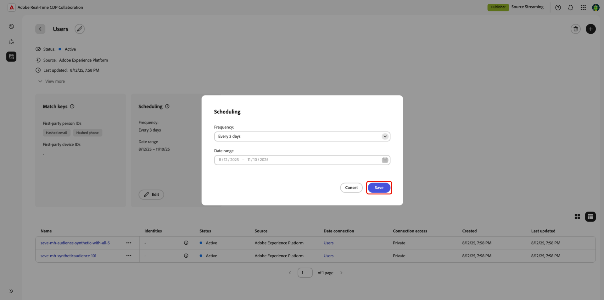

# Administrar conexiones de datos

{{limited-availability-release-note}}

## Información general

Utilice conexiones de datos en Real-Time CDP Collaboration para obtener audiencias de varias plataformas. Obtenga información sobre cómo administrar las claves de coincidencia y programar la actualización de datos para las conexiones de datos existentes. Además, podrá filtrar audiencias por atributos diferentes para obtener perspectivas más granulares.

## Ver conexiones de datos

Para ver las conexiones de datos existentes, vaya a **[!UICONTROL Configuración]** y, a continuación, seleccione la pestaña **[!UICONTROL Mis conexiones de datos]**. Se muestran todas las conexiones de datos actuales, con una breve descripción general de cada conexión. Para obtener una vista completa de la información de una conexión de datos, incluidas sus claves de coincidencia, detalles de programación y audiencias, seleccione **[!UICONTROL Ver conexión de datos]** en la conexión correspondiente.

{zoomable="yes"}

### Claves de coincidencia {#match-keys}

>[!CONTEXTUALHELP]
>id="rtcdp_collaboration_manage_dataconnections_matchkeys"
>title="Claves de coincidencia"
>abstract="Las claves de coincidencia determinan cómo coincidirán los datos de diferentes fuentes. Las claves de coincidencia que se muestran a continuación son los campos de destino a los que asignó los campos de origen."

Las claves de coincidencia son los campos de destino a los que [asignó los campos de origen](./onboard-audiences.md#map-fields). No puede editar las claves de coincidencia seleccionadas inicialmente para la conexión de datos. Para actualizar las claves de coincidencia, debe crear una nueva conexión de datos. Para obtener más información sobre cómo funcionan las claves de coincidencia, consulte la guía [claves de coincidencia](./onboard-account.md#set-up-match-keys).

{zoomable="yes"}

### Programación {#scheduling}

>[!CONTEXTUALHELP]
>id="rtcdp_collaboration_manage_dataconnections_scheduling"
>title="Programación"
>abstract="Vea los detalles de programación de su conexión de datos y edite la frecuencia de actualización si es necesario."

Ver y administrar la configuración de programación de las conexiones de datos. La programación determina la frecuencia con la que se actualiza la audiencia.

Después de crear una conexión de datos, puede actualizar su frecuencia de actualización directamente desde la sección **[!UICONTROL Programando]** del área de trabajo de conexión de datos.

>[!NOTE]
>
>Cuando se obtienen audiencias de Adobe Experience Platform, estas están disponibles en un plazo de 24 horas tras establecer la conexión de datos. Después del abastecimiento inicial, los datos de audiencia se actualizan según la frecuencia definida.

Para obtener más información sobre la programación, consulte la [sección de programación](/help/guide/setup/onboard-audiences.md#schedule) en la guía para configurar audiencias.

{zoomable="yes"}

#### Editar programación {#edit-scheduling}

Puede editar la frecuencia de una conexión de datos existente para controlar mejor la frecuencia con la que se actualizan las audiencias. Para editar la programación, selecciona **[!UICONTROL Editar]** en la conexión de datos de la tarjeta de programación.

La programación afectará a todas las audiencias procedentes de la conexión de datos.

En el cuadro de diálogo **[!UICONTROL Programación]**, seleccione el menú desplegable para actualizar la **[!UICONTROL Frecuencia]**. Configure la frecuencia de actualización para que se ejecute a diario o cada dos a seis días. Cuando termines, selecciona **[!UICONTROL Guardar]** para aplicar los cambios.

{zoomable="yes"}

## Eliminar conexión de datos

Al eliminar una conexión de datos, se eliminarán todas las audiencias subyacentes, la configuración asociada y el uso en Collaboration. Esta acción no se puede deshacer.

Para eliminar una conexión de datos existente, seleccione el icono Eliminar () en el área de trabajo de una conexión de datos individual.

{zoomable="yes"}

Aparecerá un cuadro de diálogo de confirmación. Seleccione **[!UICONTROL Eliminar]** para finalizar la eliminación de la conexión de datos.

{zoomable="yes"}

## Administrar audiencias {#manage-audiences}

En la parte inferior del espacio de trabajo se muestra una lista de audiencias adjuntas a la conexión de datos. La lista muestra una breve descripción general de cada audiencia, incluido su estado, origen y acceso a la conexión. Para editar las categorías de audiencia, el acceso a conexiones o la visibilidad de metadatos de una audiencia, seleccione el nombre de la audiencia. Para obtener una guía completa sobre cómo administrar una audiencia, consulte la guía [ver audiencias individuales](./onboard-audiences.md#view-individual-audiences).

{zoomable="yes"}

## Próximos pasos

Después de administrar las conexiones de datos, puede [descubrir superposiciones](/help/guide/collaborate/discover.md) entre sus audiencias y las audiencias que su colaborador ha hecho reconocibles.
