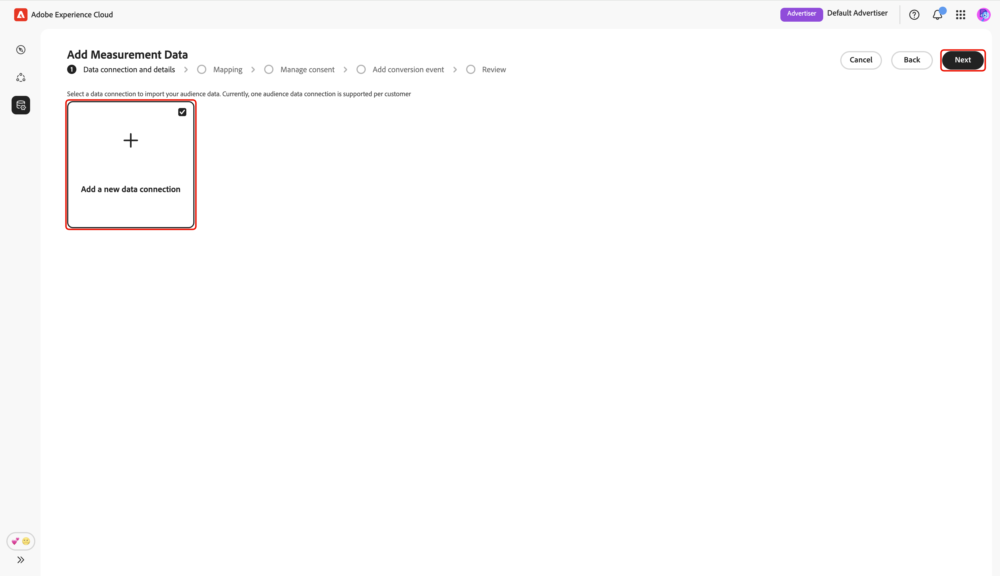
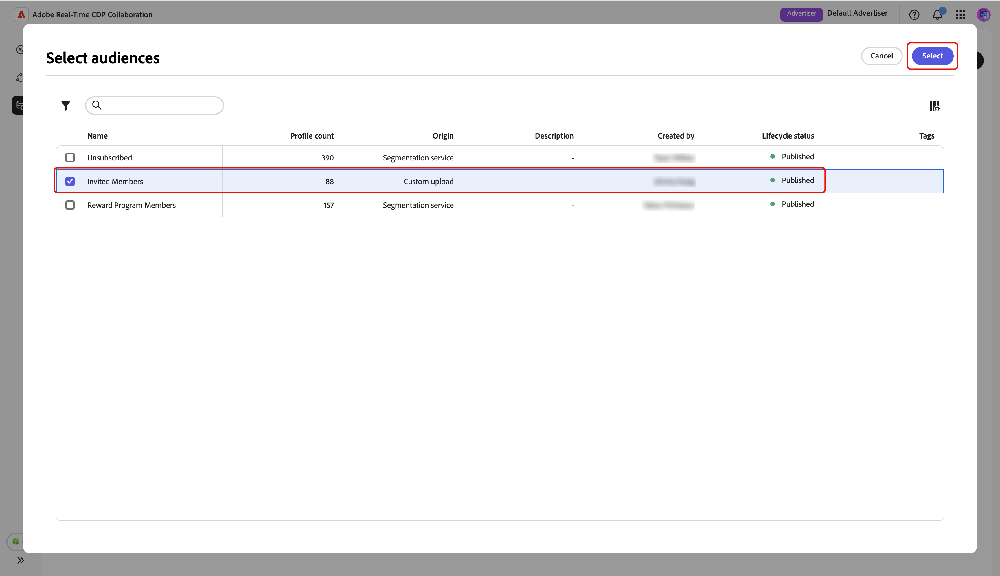
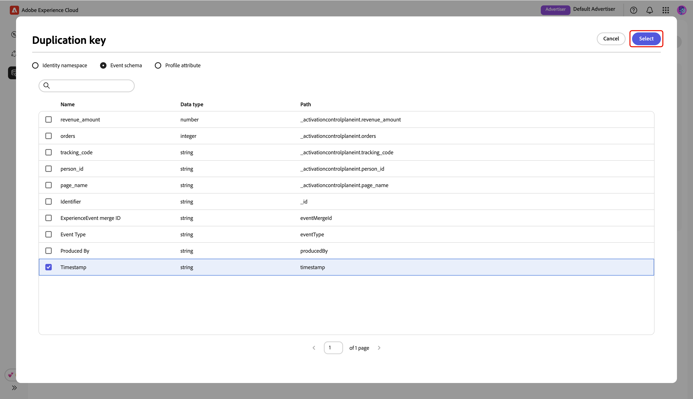
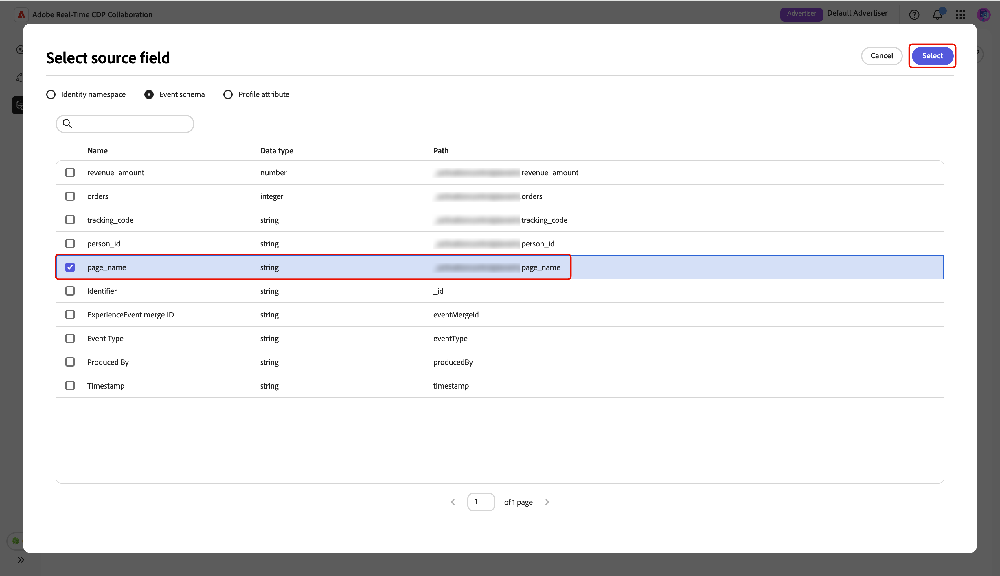

# Adición y administración de datos de medición {#add-and-manage-measurement-data}

>[!CONTEXTUALHELP]
>id="rtcdp_collaboration_onboard_measurement_data"
>title="Más información"
>abstract=""

>[!CONTEXTUALHELP]
>id="rtcdp_collaboration_measurement_data_target_fields"
>title="Campos de destino"
>abstract="Marcador de posición de los campos de destino de medición."

>[!CONTEXTUALHELP]
>id="rtcdp_collaboration_measurement_data_source_fields"
>title="Campos de origen"
>abstract="Marcador de posición de los campos de origen de medición."

>[!CONTEXTUALHELP]
>id="rtcdp_collaboration_import_measurement_mapping_source_fields"
>title="Asignar campos de origen"
>abstract="Marcador de posición de los campos de origen de medición."

>[!CONTEXTUALHELP]
>id="rtcdp_collaboration_import_measurement_mapping_target_fields"
>title="Asignar campos de destino"
>abstract="Marcador de posición los campos de destino de medición."

{{limited-availability-release-note}}

Este documento describe los pasos para agregar datos de medición de campañas a Adobe Real-Time CDP Collaboration. Los editores pueden trabajar con los equipos de Adobe para cargar los datos de medición de campañas. Una vez que los datos se hayan cargado y procesado, tanto el editor como el anunciante podrán ver [informes de medición de campañas](/help/guide/collaborate/measure.md).

## Añadir datos de medición {#add-measurement-data}

Como anunciante, puede cargar en Collaboration los datos de medición que contengan eventos de conversión para utilizarlos en informes de medición de campañas. Los datos de conversión suelen incluir campos como identificadores de usuario (por ejemplo, correo electrónico con hash o ID de dispositivo), marca de tiempo del evento de conversión y detalles específicos del evento de conversión, como compra o registro.

Para obtener datos de medición de origen, vaya a la ficha **[!UICONTROL Mis datos de medición]** en el área de trabajo **[!UICONTROL Configuración]**. Seleccione el icono de agregar () y luego seleccione **[!UICONTROL Datos de medición]**.

Si estos son sus primeros datos de medición, también puede seleccionar la opción **[!UICONTROL Agregar]**.

{zoomable="yes"}

Aparece la pantalla **[!UICONTROL Agregar datos de medición]**, que muestra un resumen de los pasos para obtener datos de medición. Seleccione **[!UICONTROL Iniciar incorporación]**.

{zoomable="yes"}

### Conexión de datos y detalles {#data-connection-and-details}

En este paso, debe configurar la conexión de datos y especificar los detalles de los datos de medición.

#### Seleccionar tipo de datos de medición {#select-measurement-data-type}

El tipo de datos de medición define el tipo de eventos que se llevan a cabo para la medición de campañas. Actualmente, el tipo compatible son los datos de conversión.

Seleccione **[!UICONTROL Datos de conversión]** como tipo de datos de medición, seguido de **[!UICONTROL Siguiente]**.

{zoomable="yes"}

#### Seleccionar conexión de datos {#select-data-connection}

Una conexión de datos es la fuente desde la que se obtienen los datos de medición en Collaboration. Una vez establecida la conexión de datos inicial y obtenido el primer conjunto de datos de medición, puede seguir obteniendo datos de medición adicionales mediante la misma conexión de datos.

Para agregar una conexión de datos, seleccione **[!UICONTROL Agregar una nueva conexión de datos]** y, a continuación, seleccione **[!UICONTROL Siguiente]**.

{zoomable="yes"}

#### Seleccionar fuente de datos {#select-data-source}

A continuación, elija el origen de la conexión de datos. En este momento, Adobe Experience Platform es la única fuente de datos compatible.

Seleccione su fuente de datos y, a continuación, seleccione **[!UICONTROL Siguiente]**.

{zoomable="yes"}

#### Selección de zona protegida {#select-sandbox}

Seleccione la zona protegida que incluye los datos de medición que desea utilizar para los informes de medición de campañas de Collaboration. Elija la zona protegida de la lista de zonas protegidas disponibles y, a continuación, seleccione **[!UICONTROL Siguiente]**.

{zoomable="yes"}

#### Seleccionar conjunto de datos de medición {#select-measurement-dataset}

Aparecerá una lista de conjuntos de datos en la zona protegida seleccionada. Seleccione un conjunto de datos como sus datos de medición, luego seleccione **[!UICONTROL Siguiente]**. Puede utilizar la opción Buscar para filtrar y encontrar el conjunto de datos preferido.

{zoomable="yes"}

#### Proporcione un nombre y detalles {#provide-name-and-details}

A continuación, proporcione un nombre y una descripción para la conexión de datos. Esta información le ayudará a identificar la conexión de datos más adelante.

{zoomable="yes"}

### Asignación {#mapping}

El siguiente paso es asignar campos de los datos de medición a los campos de destino correspondientes utilizados en Collaboration. También puede enriquecer el conjunto de datos de evento con atributos del perfil del cliente en tiempo real asignando claves de unión y utilizar estos atributos para desglosar los informes de medición.

#### Enriquecimiento de datos de evento {#enrich-event-data}

Para enriquecer los datos de evento, seleccione la opción **[!UICONTROL clave de unión al campo de Source]**.

{zoomable="yes"}

En el cuadro de diálogo **[!UICONTROL clave de combinación de campos de Source]**, elija el campo de origen, seguido de **[!UICONTROL Seleccionar]**.

{zoomable="yes"}

A continuación, seleccione la opción **[!UICONTROL Clave de unión de perfil]**. En el cuadro de diálogo **[!UICONTROL Clave de unión de perfil]**, seleccione el campo de perfil de la lista. Puede utilizar la opción Buscar para encontrar el campo deseado. A continuación, elija **[!UICONTROL Seleccionar]** para confirmar.

{zoomable="yes"}

#### Asignación de campos {#mapping-fields}

Para empezar a asignar campos de origen de los datos de medición a los campos de destino en Collaboration, seleccione el campo de origen vacío en la pantalla **[!UICONTROL Mapping]**.

{zoomable="yes"}

Aparece el cuadro de diálogo **[!UICONTROL Seleccionar campo de origen]**, que muestra una lista de los campos de origen disponibles agrupados en opciones como **[!UICONTROL Área de nombres de identidad]** y **[!UICONTROL Esquema de evento]**. Puede utilizar la opción de búsqueda para filtrar y encontrar el campo de origen de la lista.

Elija el campo de origen que desee, seguido de **[!UICONTROL Seleccionar]**.

{zoomable="yes"}

A continuación, utilice el menú desplegable para asignar el campo de origen seleccionado a un campo de destino adecuado. Todos los campos de destino disponibles son las [claves de coincidencia configuradas para su cuenta de Collaborator](./onboard-account.md#set-up-match-keys).

{zoomable="yes"}

Puede agregar o quitar filas de asignación según sea necesario. Si necesita asignar un campo de origen sin hash a un campo de destino con hash (por ejemplo, asignar un correo electrónico de texto sin hash a [!UICONTROL Correo electrónico con hash]), use la opción **[!UICONTROL Aplicar transformación]** para aplicar el hash requerido.

Cuando haya terminado, revise los campos asignados y las claves de unión si el enriquecimiento está habilitado. A continuación, seleccione **[!UICONTROL Siguiente]**.

{zoomable="yes"}

### Administrar el consentimiento {#manage-consent}

Antes de continuar, debe reconocer que el uso de datos en Collaboration cumple con las políticas de gobernanza de datos de Real-Time CDP. Todos los datos deben filtrarse previamente de acuerdo con los requisitos de consentimiento o cualquier política de consentimiento personalizada aplicable, por lo que no se requiere ningún procesamiento adicional.

Para confirmar tu confirmación, selecciona **[!UICONTROL Siguiente]**.

{zoomable="yes"}

Si [habilita el enriquecimiento de perfiles durante el paso de asignación](#enrich-event-data), puede configurar directivas de consentimiento a partir de una lista de opciones predefinidas. Esto incluye:

* **Acciones de marketing**: utilice estas acciones de marketing para controlar qué datos de audiencia se incluirán en Collaboration desde Experience Platform.
* **Reglas de consentimiento**: seleccione las reglas de consentimiento que se aplicarán a los datos que se originan en Collaboration.
* **Audiencia**: use el filtro de audiencia para incluir o excluir perfiles de audiencia para el consentimiento.

>[!NOTE]
>
>**[!UICONTROL Data Collaboration]** admite las etiquetas de uso de datos C4, C5 y C9, mientras que **[!UICONTROL Data Science]** solo admite C9. Obtenga más información sobre las etiquetas de uso de datos en la documentación de Experience Platform:
>
>* [Información general sobre las etiquetas de uso de datos](https://experienceleague.adobe.com/es/docs/experience-platform/data-governance/labels/overview){target="_blank"}
>* [Glosario](https://experienceleague.adobe.com/es/docs/experience-platform/data-governance/labels/reference){target="_blank"}

Seleccione la configuración preferida y luego seleccione **[!UICONTROL Siguiente]**.

{zoomable="yes"}

Antes de continuar, debe confirmar y aceptar los términos del cuadro de diálogo **[!UICONTROL Directiva de gobernanza y acciones de aplicación]**. Seleccione la casilla de verificación, seguida de **[!UICONTROL Aceptar]**.

{zoomable="yes"}

#### Filtro de público {#audience-filter}

Para incluir o excluir determinados perfiles de audiencia para el consentimiento, utilice el menú desplegable **[!UICONTROL Filtro de audiencia]**. Una vez que seleccione este filtro, la interfaz de usuario se actualizará para mostrar la opción **[!UICONTROL Examinar audiencias]**. Seleccionar **[!UICONTROL audiencias de exploración]**.

{zoomable="yes"}

Aparecerá el cuadro de diálogo **[!UICONTROL Seleccionar audiencias]**. Elija una audiencia de la lista, seguida de **[!UICONTROL Select]**.

{zoomable="yes"}

La audiencia elegida aparece ahora, con la opción de eliminarla si es necesario. Revisa tu configuración de consentimiento y, a continuación, selecciona **[!UICONTROL Siguiente]**.

{zoomable="yes"}

### Añadir evento de conversión {#add-conversion-event}

A continuación, defina los eventos de conversión que desea que midan el impacto de sus campañas en, por ejemplo, visitas al sitio, registros o compras completadas. Puede especificar hasta **3** eventos de conversión distintos para la medición.

Proporcione el nombre del evento de conversión y, a continuación, utilice el menú desplegable para seleccionar el tipo de conversión.

{zoomable="yes"}

Puede introducir un valor para la conversión o dejarlo vacío si no desea asignar un valor en este momento.

{zoomable="yes"}

A continuación, debe especificar la clave de duplicación para indicar qué filas del conjunto de datos de evento pertenecen al mismo evento de conversión subyacente (por ejemplo, la misma marca de tiempo durante un proceso de registro). Esto evita contar la misma conversión varias veces en los informes de medición. Para ello, seleccione **[!UICONTROL Clave de duplicación]**. En el diálogo **[!UICONTROL Clave de duplicación]**, busque y elija la clave, seguida de **[!UICONTROL Seleccionar]**.

{zoomable="yes"}

Después de especificar la clave de duplicación, puede agregar hasta **5** condiciones para incluir solo las filas relevantes del conjunto de datos de evento para la conversión. Elija aplicar todas o cualquiera de estas condiciones.

Seleccione **[!UICONTROL Agregar condición]** y luego seleccione la opción de condición.

{zoomable="yes"}

En el diálogo **[!UICONTROL Seleccionar campo de origen]**, busque y elija un campo de origen para la regla de condición, seguido de **[!UICONTROL Seleccionar]**.

{zoomable="yes"}

Utilice el menú desplegable para seleccionar un operador lógico e introduzca el valor para la regla de configuración.

{zoomable="yes"}

Para agregar otro evento de conversión, seleccione **[!UICONTROL Agregar conversión]**. Puede incluir hasta **3** eventos de conversión en total. Una vez finalizada, revise las configuraciones de conversión y seleccione **[!UICONTROL Siguiente]**.

{zoomable="yes"}

### Revisar {#review}

Aparece la pantalla **[!UICONTROL Revisar]** con un resumen de la configuración de los datos de medición. Revise y asegúrese de que toda la información es correcta. Si necesita cambiar alguna sección, use la opción **[!UICONTROL Editar]**.

Finalmente, seleccione **[!UICONTROL Completar]** para finalizar la adición de los datos de medición.

{zoomable="yes"}

Un cuadro de diálogo de confirmación confirma que los datos de medición se han creado correctamente. Puede ver los nuevos eventos de conversión configurados a partir de los datos de medición en el área de trabajo **[!UICONTROL Mis datos de medición]**.

{zoomable="yes"}

En la vista de cuadrícula o en la vista de tabla, seleccione un elemento de fila o la opción **[!UICONTROL Ver conversión]** dentro de una tarjeta de evento para ver una descripción general de un evento de conversión específico. Muestra el estado del evento, el origen y el nombre de la conexión de datos, junto con paneles detallados para:

* **[!UICONTROL Detalles de conversión]**: muestra información clave sobre la conversión, incluido su tipo, la clave de duplicación utilizada para identificar eventos únicos y el valor de conversión asignado (si se especifica).
* **[!UICONTROL Condiciones]**: muestra las reglas de condición aplicadas a este evento de conversión.

{zoomable="yes"}

## Editar datos de medición {#edit-measurement-data}

Después de obtener los datos de medición, puede editar los detalles y las reglas de condición de un evento de conversión en cualquier momento.

En la ficha **[!UICONTROL Mis datos de medición]**, seleccione la opción de puntos suspensivos () en la tarjeta de evento de conversión correspondiente. A continuación, seleccione **[!UICONTROL Ver conversión]** en el menú desplegable para abrir la página detallada de ese evento de conversión.

{zoomable="yes"}

### Editar nombre y descripción {#edit-name-and-description}

Para actualizar el nombre y la descripción del evento, seleccione el icono de edición () en la parte superior derecha de la página.

{zoomable="yes"}

En el cuadro de diálogo **[!UICONTROL Editar nombre y descripción]**, actualice los campos con los valores deseados y, a continuación, seleccione **[!UICONTROL Guardar]** para aplicar los cambios.

{zoomable="yes"}

Aparecerá un cuadro de diálogo de confirmación para confirmar que los detalles se han actualizado correctamente.

### Editar detalles de la conversión {#edit-conversion-details}

Puede actualizar los siguientes detalles de conversión del evento:

| Campo | Descripción |
|-------------------|-------------|
| Tipo de conversión | La categoría del evento de conversión, como una visita al sitio, una compra o un registro. |
| Clave de duplicación | Identificador de filas del conjunto de datos de evento que pertenecen al mismo evento de conversión (por ejemplo, la misma marca de tiempo). Evita recuentos duplicados. |
| Valor de conversión | El valor asociado con cada conversión. |

{style="table-layout:auto"}

Para empezar a editar, selecciona **[!UICONTROL Editar]** en el panel **[!UICONTROL Detalles de conversión]**.

{zoomable="yes"}

En el cuadro de diálogo **[!UICONTROL Editar detalles de conversión]**, use el menú desplegable para actualizar el tipo de conversión. Puede introducir un valor para la conversión o dejarlo vacío si no desea asignar un valor. Para editar la clave de duplicación, seleccione la opción clave existente.

{zoomable="yes"}

El cuadro de diálogo **[!UICONTROL Clave de duplicación]** muestra una lista de campos disponibles agrupados en opciones como **[!UICONTROL Área de nombres de identidad]** y **[!UICONTROL Esquema de evento]**. Busque y elija la clave que desee, seguida de **[!UICONTROL Select]**.

{zoomable="yes"}

Una vez que finalice, revisa las actualizaciones y selecciona **[!UICONTROL Guardar]** para aplicar los cambios.

{zoomable="yes"}

Aparecerá un cuadro de diálogo de confirmación para confirmar que los detalles se han actualizado correctamente.

### Editar condiciones {#edit-conditions}

Las reglas de condición especifican qué filas de datos del conjunto de datos de evento se incluyen como conversiones. Actualice estas reglas según sea necesario para garantizar que la medición refleje únicamente los datos más relevantes para el análisis.

Para editar condiciones, seleccione **[!UICONTROL Editar]** en el panel **[!UICONTROL Condiciones]**.

{zoomable="yes"}

En el diálogo **[!UICONTROL Editar reglas de conversión]**, puede ver los detalles actuales de todas las condiciones. Seleccione una opción de condición existente para actualizar sus detalles, incluidos el campo de origen, la regla lógica y el valor.

{zoomable="yes"}

Para incluir reglas de conversión adicionales, seleccione **[!UICONTROL Agregar condición]**. A continuación, seleccione la nueva opción de condición vacía.

{zoomable="yes"}

En el cuadro de diálogo **[!UICONTROL Seleccionar campo de origen]**, puede ver los campos disponibles agrupados en opciones como **[!UICONTROL área de nombres de identidad]** y **[!UICONTROL esquema de evento]**. Seleccione el campo apropiado que desee usar para la condición y, a continuación, elija **[!UICONTROL Seleccionar]**. Puede usar la opción **[!UICONTROL Buscar]** para encontrar rápidamente su campo preferido.

{zoomable="yes"}

A continuación, utilice el menú desplegable para seleccionar un operador lógico de la lista disponible e introducir un valor para la condición.

{zoomable="yes"}

Use **[!UICONTROL Incluir todas las condiciones]** si se requieren todas las condiciones especificadas para cada conversión, o use **[!UICONTROL Incluir cualquiera de las condiciones]** para permitir conversiones que coincidan con al menos una condición. Cuando termine de actualizar, revise y seleccione **[!UICONTROL Guardar]** para aplicar los cambios.

{zoomable="yes"}

Aparecerá un cuadro de diálogo de confirmación para confirmar que los detalles se han actualizado correctamente.

## Eliminar datos de medición {#delete-measurement-data}

Al eliminar los datos de medición, se eliminan permanentemente del proyecto el evento de conversión asociado y todos los detalles de medición vinculados. Cualquier informe de medición que dependa de este evento perderá las métricas de conversión correspondientes y ya no se podrá actualizar. Esta acción no se puede deshacer.

Para eliminar un evento de conversión existente, vaya a la ficha **[!UICONTROL Mis datos de medición]** en el área de trabajo **[!UICONTROL Configuración]**. En la vista de cuadrícula, seleccione **[!UICONTROL Eliminar]** en la tarjeta de evento correspondiente. En la vista de tabla, seleccione el icono de eliminación () junto al nombre del evento.

{zoomable="yes"}

Aparecerá el cuadro de diálogo **[!UICONTROL Eliminar medición]**, que le pedirá que confirme la eliminación del evento. Seleccione **[!UICONTROL Eliminar]**.

{zoomable="yes"}

Aparecerá un cuadro de diálogo de confirmación para confirmar que el evento de conversión se ha eliminado correctamente.

## Próximos pasos {#next-steps}

Ha completado el abastecimiento de los datos de medición en Collaboration. Como anunciante, ahora puede crear informes de atribución para explorar cómo las campañas generan conversiones y miden el impacto general. Si es editor, solicite a su colaborador que genere un informe de atribución para sus campañas. Para obtener instrucciones detalladas, consulte la guía [Crear informe de atribución](../collaborate/measure.md#create-attribution-report).
