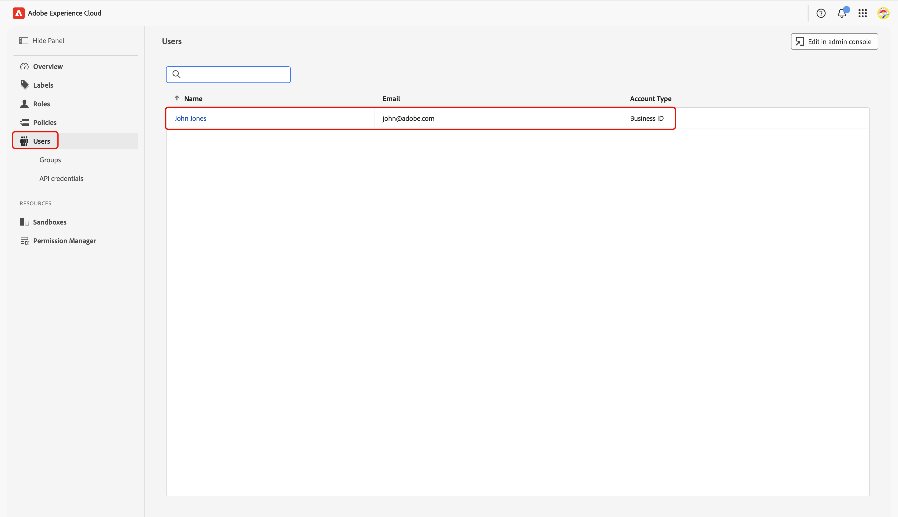

# Configurar controles de permisos para la incorporación de Collaboration [!DNL Starter]

Después de configurar el acceso de administrador y usuario a los productos de Adobe Experience Platform, debe asignarse a sí mismo funciones con los permisos adecuados para Real-Time CDP Collaboration. Lea esta guía para aprender a agregar las funciones correctas a su cuenta a través de la interfaz de Permisos de Experience Cloud, de modo que pueda acceder y administrar el acceso de los usuarios a las funciones de Collaboration.

Para obtener más información sobre las funciones estándar y los permisos disponibles incluidos en el recurso de Collaboration, consulte [guía de administración de funciones](../permissions/manage-roles.md).

## Requisitos previos {#prerequisites}

Asegúrese de que tiene **privilegios de administrador** y **acceso de usuario** al producto de Adobe Experience Platform. Si aún no ha configurado estos niveles de acceso, consulte la [guía de acceso del administrador](./starter-admin-access.md) para obtener instrucciones paso a paso.

## Configuración de permisos {#setup-permissions}

Siga los pasos a continuación para configurar los permisos que necesita para Collaboration. Primero, inicia sesión en [Adobe Experience Cloud](https://experience.adobe.com/) con tus credenciales.

### Permisos de acceso {#access-permissions}

Una vez que haya iniciado sesión, vaya a la sección **[!UICONTROL Acceso rápido]** y seleccione **[!UICONTROL Permisos]**. Se abrirá el panel Permisos, donde podrá asignarse a sí mismo las funciones necesarias.

{zoomable="yes"}

### Seleccionar un usuario {#select-user}

En el panel **[!UICONTROL Permisos]**, seleccione **[!UICONTROL Usuarios]** en el panel izquierdo. A continuación, seleccione su cuenta de la tabla Usuarios.

>[!NOTE]
>
> Si es el primer usuario de su organización en acceder a Experience Platform, es posible que sea el único que aparezca en la tabla **Usuarios**. Para invitar a otros integrantes del equipo, siga los pasos de la [guía de configuración de acceso de usuario](../permissions/manage-user-access.md#administrators-configure-user-access-to-experience-platform).

{zoomable="yes"}

### Asignar funciones {#assign-roles}

En el área de trabajo **[!UICONTROL Usuario]** correspondiente, vaya a la pestaña **[!UICONTROL Roles]**. Luego selecciona **[!UICONTROL Agregar roles]**.

{zoomable="yes"}

Aparecerá el cuadro de diálogo **[!UICONTROL Agregar roles]** con una tabla de roles disponibles. Cada fila de la tabla representa un rol con la siguiente información:

| **Columna** | **Descripción** |
|---------------|--------------------------------------------------------|
| **Nombre** | Nombre de la función. |
| **Descripción** | Un breve resumen que describe la función de la función. Tenga en cuenta que las funciones de &quot;solo lectura&quot; no se pueden personalizar. |
| **Zonas protegidas** | Especifica a qué zonas protegidas (por ejemplo, `Prod`) proporciona acceso el rol. |
| **Modificado** | Fecha en la que se actualizó la función por última vez. |

{style="table-layout:auto"}

Para obtener información detallada sobre una función específica y sus permisos, consulte la guía [Administrar permisos para una función](https://experienceleague.adobe.com/es/docs/experience-platform/access-control/abac/permissions-ui/permissions).

Revise la información y seleccione las funciones que desee asignar a su cuenta. Cuando termine, seleccione **[!UICONTROL Guardar]**.

El cuadro de diálogo {zoomable="yes"}

Un cuadro de diálogo de confirmación confirma que las nuevas funciones se agregaron correctamente.

Para asegurarte de que los permisos estén configurados correctamente, vuelve a la página principal de [Experience Cloud](https://experience.adobe.com/). Seleccione **[!UICONTROL Real-Time CDP Collaboration]** en **[!UICONTROL Acceso rápido]**. Debería poder acceder a Collaboration Workspace y empezar a utilizar las funciones disponibles para su cuenta de [!DNL Starter].

## Próximos pasos {#next-steps}

Con los permisos configurados, está listo para acceder a Collaboration. A continuación, puede:

* [Cree funciones personalizadas con permisos específicos para administrar diferentes niveles de acceso](../permissions/manage-roles.md#create-specific-access-roles).
* [Asignar varios usuarios a una función en Permisos](../permissions/manage-user-access.md#assign-a-role).
* [Configura la cuenta de Collaboration y establece conexiones con tu colaborador invitado](../overview/starter-overview.md#set-up-connections).
* [Más información acerca del uso y consumo de crédito en Collaboration [!DNL Starter]](./starter-credit-usage.md).

Para obtener una descripción general completa de Real-Time CDP Collaboration y sus características clave, lee la [guía de información general](../home.md).
