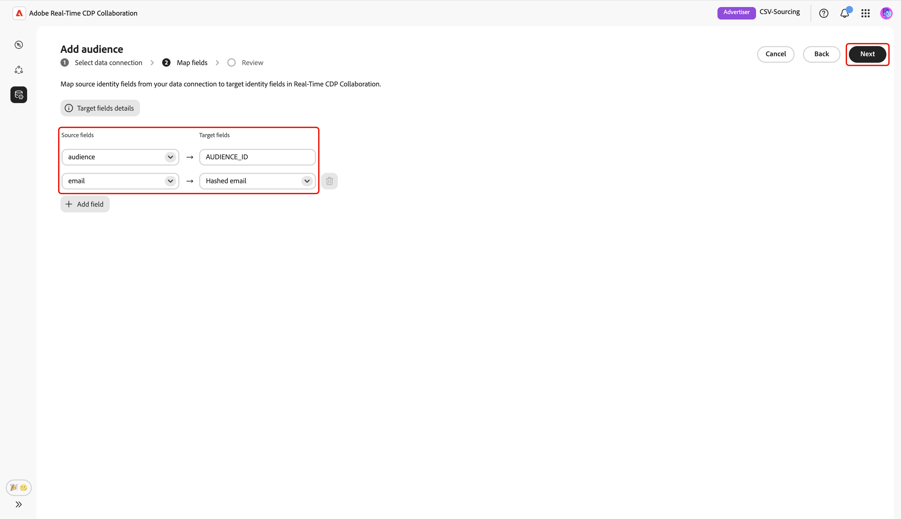
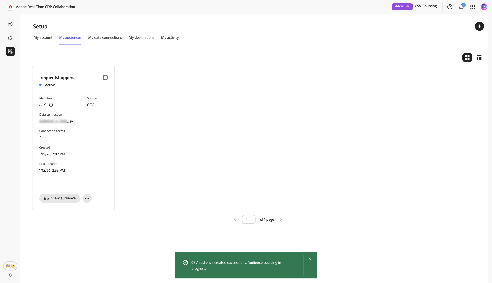

# Cargar archivo CSV para el abastecimiento de audiencias

Esta guía proporciona los pasos para cargar un archivo CSV en la interfaz de usuario de Adobe Real-Time CDP Collaboration para obtener los datos de audiencia y utilizarlos en proyectos de colaboración.

## Información general {#overview}

La carga de archivos CSV es un método para obtener datos de audiencia de origen para proyectos de colaboración. Esta es una alternativa a [conectar tu AWS S3 bucket](./configure-aws-s3-audience-sourcing.md), [conectar Google Cloud Storage](./configure-gcs-audience-sourcing.md) o [obtener audiencias de Experience Platform](./onboard-audiences.md).

Siga este flujo de trabajo para cargar un archivo CSV que contenga los datos de audiencia en el origen y administrar audiencias de origen en Collaboration. Puede asignar campos de identidad para la activación y el análisis de superposición. Una vez que se carga y procesa el archivo, la audiencia de origen queda disponible en el área de trabajo de **[!UICONTROL Mis audiencias]**, donde puede revisar, activar y administrar sus proyectos de colaboración.

>[!IMPORTANT]
>
>* Las audiencias que se obtuvieron mediante la carga de CSV están disponibles durante **7 días**. Después de este periodo, la audiencia caduca y debe volver a cargarse para usarla en sus proyectos de colaboración.
>
>* En este momento puede cargar un archivo CSV por sesión. Para añadir audiencias adicionales, complete de nuevo el flujo de trabajo de carga para cada archivo de origen que desee.

## Requisitos previos {#prerequisites}

Antes de cargar archivos CSV para el abastecimiento de audiencias, asegúrese de lo siguiente:

* Incorporación de la cuenta completada en Real-Time CDP Collaboration. Consulte [Incorporar su cuenta](./onboard-account.md) para obtener instrucciones paso a paso.
* Los permisos necesarios para agregar audiencias en su organización.
* Un archivo CSV que contiene los datos de audiencia con campos de identidad como correo electrónico o teléfono.

## Cargar un archivo CSV {#upload-csv-file}

En la ficha **[!UICONTROL Mis audiencias]** del área de trabajo **[!UICONTROL Configuración]**, seleccione el icono de agregar () y luego seleccione **[!UICONTROL Audiencia]**.

Si esta es su primera audiencia, también puede seleccionar la opción **[!UICONTROL Agregar]**.

Aparecerá el flujo de trabajo Añadir audiencia. Seleccione **[!UICONTROL Agregar una nueva conexión de datos]** y, a continuación, seleccione **[!UICONTROL Siguiente]**.

{zoomable="yes"}

### Select CSV File as the data connection {#select-csv-file}

Select **[!UICONTROL CSV File]** as a data connection, followed by **[!UICONTROL Next]**.

### Select file {#select-file}

Choose **[!UICONTROL Select from computer]** to upload a CSV file from your local system. Alternatively, you can drag and drop the CSV file you want to upload into the [!UICONTROL Drag and drop a CSV file] panel.

>[!IMPORTANT]
>
>Only CSV files are supported. The maximum file size is **2 GB**.

Once uploaded, the UI shows a summary including the number of columns, an estimated row count, the structure of the file, and a preview of the first 10 rows of data.

Review the summary, then select **[!UICONTROL Next]**.

#### Reemplazar archivo {#replace-file}

If you need to upload a different CSV file, choose **[!UICONTROL Replace file]** and select your new file. The interface then refreshes to display an updated summary of the new data.

After reviewing the revised summary, select **[!UICONTROL Next]**.

### Confirm consent acknowledgment {#confirm-consent}

Before proceeding, you must acknowledge that consent opt-outs have been removed from your audience data. Collaboration requires clean audience data without users who have opted out of data sharing.

Check the confirmation box followed by **[!UICONTROL OK]** to confirm. The dialog then closes, and you proceed to the map fields screen.

### Map source identity fields {#map-fields}

Field mapping determines how Collaboration uses your audience data for activation and overlap analysis. On the **[!UICONTROL Map fields]** screen, use the dropdown menus to map each source identity field from your CSV file to the appropriate target field in Collaboration.

If you need additional details about a target field including the data type or description, select **[!UICONTROL Target fields details]** for more information.

Next, review the mapped fields, and then select **[!UICONTROL Next]**.

### Review and complete the upload {#review-and-complete}

The **[!UICONTROL Review]** screen appears with a summary of the audience settings from your CSV file. Review the information in the following sections:

* **[!UICONTROL File Information]**: Displays the file name, the number of columns, and the estimated row count.
* **[!UICONTROL Mapping]**: Lists how the source fields from your uploaded audience file (for example, `email`) map to target fields used in Collaboration (for example, Hashed email).

Select the pencil icon if you need to edit a section. Select **[!UICONTROL Complete]** to confirm all sections.

A progress bar appears below the summary sections to indicate upload progress. Once the upload completes, a confirmation dialog confirms that your CSV audience was created and audience sourcing is in progress.

## Review sourced audiences {#review-sourced-audiences}

After uploading your CSV file, Collaboration begins sourcing audiences from the file. This process may take several minutes. When the sourcing finishes, your audiences are available in the **[!UICONTROL My Audiences]** tab with the same features and information as audiences sourced from Experience Platform.

When in grid view or table view, select a row item or **[!UICONTROL View audience]** to see an overview of a specific audience. It displays the audience&#39;s status, source, and data connection name, along with detailed panels for:

**[!UICONTROL Identities]**: Displays the total identity count and breakdown once data becomes available.
**[!UICONTROL Categories]**: Displays any tags used for organizing or filtering the audience.
**[!UICONTROL Connection access]**: Displays whether the audience is private, public, or shared with specific collaborators.
**[!UICONTROL Metadata visibility]**: Displays what audience information (such as identity count, overlap percentage, and index) is visible to collaborators.

Use this view to confirm audience configuration and visibility settings before using the audience in collaboration projects. For more information, see [how to view an individual audience](./onboard-audiences.md#view-individual-audiences).

## Próximos pasos {#next-steps}

You have now successfully uploaded your CSV file in Collaboration. After sourcing completes, you can:

* Create collaboration projects with your sourced audiences. See [Discover audiences](../../guide/collaborate/discover.md).
* Activate audiences to connected destinations. See [Activate audiences](../../guide/collaborate/activate.md).
* Review audience overlap and insights. See [Measure campaign performance](../../guide/collaborate/measure.md).
* Manage your audience settings and visibility. See [Source and manage audiences](./onboard-audiences.md).

For information about other audience sourcing methods, see [Configure AWS S3 for audience sourcing](./configure-aws-s3-audience-sourcing.md) or [Source audiences from Experience Platform](./onboard-audiences.md).
